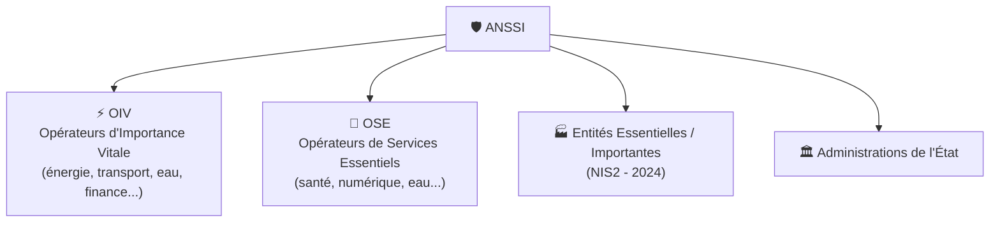

---
tags:
  - Cybersecurite
  - ANSSI
  - Gouvernance
---

# ANSSI — Agence Nationale de la Sécurité des Systèmes d'Information

L'**ANSSI** est l'autorité nationale française en matière de cybersécurité. Créée en 2009, elle est rattachée au **Secrétariat Général de la Défense et de la Sécurité Nationale (SGDSN)** et placée sous l'autorité du Premier Ministre. Elle joue un double rôle : **défense** des SI nationaux et **conseil / régulation** pour les acteurs publics et privés.

## Missions principales

| Mission | Description |
| :--- | :--- |
| **Autorité nationale** | Référence officielle en matière de cybersécurité en France |
| **Protection des SI de l'État** | Défense des réseaux gouvernementaux (SGDSN, Élysée...) |
| **Réponse aux incidents** | Assistance aux OIV/OSE et aux organisations victimes d'attaques majeures |
| **Publication de guides** | Guides de bonnes pratiques à destination de tous les publics |
| **Certification et qualification** | Évalue et qualifie les produits et services de sécurité |
| **Sensibilisation** | Campagnes nationales (Cybermalveillance.gouv.fr, Mois de la Cyber...) |
| **Régulation NIS2** | Autorité compétente pour l'application de la directive NIS2 en France |

## Les acteurs sous supervision de l'ANSSI

### OIV (Opérateurs d'Importance Vitale)
Désignés par arrêté **secret défense**, ils couvrent les 12 secteurs d'activité vitaux pour la Nation (énergie, eau, transport, santé, finance, télécoms...). Soumis aux obligations les plus strictes de la **LPM** (Loi de Programmation Militaire) :
* Systèmes d'Information d'Importance Vitale (SIIV) identifiés
* Obligation de déclarer les incidents à l'ANSSI
* Audits de sécurité imposés

### OSE (Opérateurs de Services Essentiels)
Définis par la directive **NIS1** (transposée en France en 2018), ils incluent des acteurs clés de secteurs comme l'eau, la santé, le numérique, l'énergie. Moins contraignants que les OIV mais soumis à des obligations de sécurité et de déclaration d'incidents.

## Principaux guides et référentiels publiés

| Guide | Description |
| :--- | :--- |
| **Guide d'hygiène informatique** | 42 mesures de base pour tout type d'organisation |
| **PRIS** (Prestataires de Réponse aux Incidents de Sécurité) | Label pour les prestataires d'incident response |
| **PASSI** (Prestataires d'Audit SSI) | Qualification des prestataires d'audit |
| **SecNumCloud** | Référentiel de qualification cloud pour données sensibles de l'État |
| **RGS** (Référentiel Général de Sécurité) | Règles à respecter pour les téléservices de l'État |
| **EBIOS RM** | Méthode d'analyse de risque ([voir la page dédiée](ebios.md)) |
| **Guide ransomware** | Bonnes pratiques de prévention et plans de réponse |
| **Guide PCA/PRA** | Recommandations pour la continuité ([voir la page dédiée](pca_pra.md)) |

## En cas de cyberattaque

L'ANSSI ne peut pas intervenir sur tous les incidents. Le portail de référence pour les PME/TPE et les particuliers est **[Cybermalveillance.gouv.fr](https://www.cybermalveillance.gouv.fr)** (aussi sous supervision de l'ANSSI). Il permet de :
* Être mis en relation avec un prestataire local de confiance
* Accéder à des fiches de procédures par type d'attaque (ransomware, phishing, DDoS...)
* Déposer un signalement

Pour les incidents majeurs touchant les OIV/OSE ou les administrations de l'État, contacter directement l'ANSSI via le **CERT-FR** (Centre gouvernemental de veille, d'alerte et de réponse aux attaques informatiques).

## Voir aussi

* [CNIL — Protection des données personnelles](cnil.md)
* [Normes et Réglementation (LPM, NIS2, RGPD...)](normes_reglementation.md)
* [EBIOS RM — Méthode d'analyse de risque](ebios.md)
