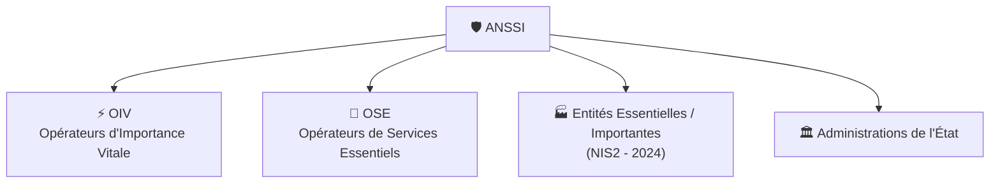

---
tags:
  - Cybersecurite
  - ANSSI
  - Gouvernance
---

# ANSSI (Agence Nationale de la Sécurité des Systèmes d'Information)

L'autorité nationale française en matière de cybersécurité et de défense des systèmes d'information.

## 1. Définition
Créée en 2009 et rattachée au Premier Ministre, l'**ANSSI** est l'autorité nationale française en matière de cybersécurité. Elle assure la défense des SI de l'État et joue un rôle de conseil, de régulation et d'assistance pour les acteurs publics et privés.

## 2. Description / Fonctionnement
Ses missions couvrent un large spectre :
* **Défense** : Protection des réseaux gouvernementaux.
* **Réponse aux incidents** : Assistance via le CERT-FR lors d'attaques majeures (ransomware, espionnage).
* **Régulation** : Application des lois (LPM, NIS2) sur les entités critiques.
* **Qualification** : Certification de produits et services (Prestataires PRIS, PASSI, SecNumCloud).
* **Sensibilisation** : Publication de guides de bonnes pratiques et plateformes grand public (Cybermalveillance.gouv.fr).

## 3. Utilisation / Cas Pratique
L'ANSSI supervise et impose des règles de sécurité très strictes à des organismes spécifiques :
* **OIV (Opérateurs d'Importance Vitale)** : Secteurs vitaux pour la Nation (secret défense).
* **OSE (Opérateurs de Services Essentiels)** : Acteurs clés de l'économie (santé, eau, énergie).
* **EE/EI (Entités Essentielles / Importantes)** : Nouveaux acteurs régulés depuis la directive NIS2 (2024).

## 4. Modifications possibles / Alternatives
L'ANSSI collabore avec ses homologues européens (comme le BSI en Allemagne) ou l'ENISA (Agence de l'UE pour la cybersécurité) pour harmoniser les standards de sécurité et le partage de renseignements (Threat Intelligence).

## 5. Exemples visuels et Liens utiles
### Les acteurs sous supervision

* **Lien utile** : [Site officiel de l'ANSSI](https://www.ssi.gouv.fr/)
* **Lien utile** : [Cybermalveillance.gouv.fr](https://www.cybermalveillance.gouv.fr) pour les PME/TPE victimes d'attaques.
