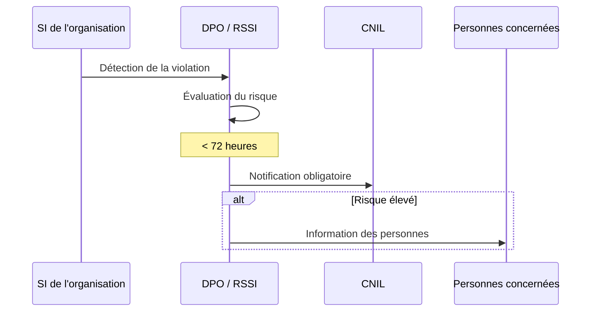

---
tags:
  - Cybersecurite
  - CNIL
  - RGPD
  - Gouvernance
---

# CNIL (Commission Nationale de l'Informatique et des Libertés)

Autorité administrative française chargée de veiller à la protection des données personnelles.

## 1. Définition
La **CNIL** est l'autorité administrative indépendante française chargée de veiller à la **protection des données personnelles** et au respect de la vie privée. Elle est l'autorité de contrôle officielle du RGPD en France.

## 2. Description / Fonctionnement
La CNIL dispose de plusieurs missions et pouvoirs :
* **Information & Accompagnement** : Informer les citoyens sur leurs droits et publier des guides pratiques pour les organisations.
* **Contrôle** : Effectuer des contrôles sur pièces, sur place ou en ligne pour vérifier la bonne conformité RGPD (Registre des traitements, Consentement, Sécurité...).
* **Sanction** : Pouvoir d'avertissement, de mise en demeure, ou de prononcer de très lourdes amendes administratives (jusqu'à 20 millions d'euros ou 4% du CA mondial).

## 3. Utilisation / Cas Pratique
Les DSI et RSSI interagissent avec la CNIL via le DPO (Délégué à la Protection des Données). En cas de cyberattaque entraînant une fuite de données personnelles, l'entreprise a l'obligation légale de notifier la CNIL dans un délai strict de 72 heures sous peine de sanctions.

## 4. Modifications possibles / Alternatives
Chaque pays européen dispose de sa propre autorité de contrôle (ex: la *BfDI* en Allemagne, l'*AEPD* en Espagne), mais toutes travaillent ensemble au sein du CEPD (Comité Européen de la Protection des Données) pour garantir une application uniforme du RGPD en Europe.

## 5. Exemples visuels et Liens utiles

### Notification de violation de données

* **Lien utile** : [Site officiel de la CNIL](https://www.cnil.fr) et outil PIA open-source.
