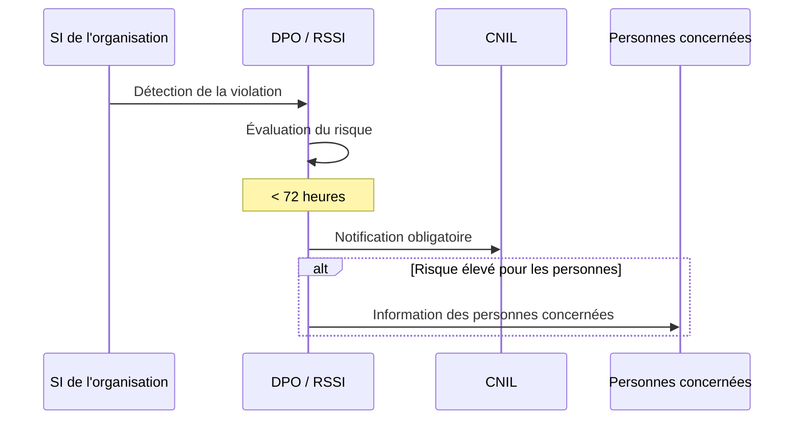

---
tags:
  - Cybersecurite
  - CNIL
  - RGPD
  - Gouvernance
---

# CNIL — Commission Nationale de l'Informatique et des Libertés

La **CNIL** est l'autorité administrative indépendante française chargée de veiller à la **protection des données personnelles** et au respect de la vie privée. Elle est l'**autorité de contrôle** du RGPD en France.

## Rôles et missions

| Mission | Description |
| :--- | :--- |
| **Autorité de contrôle RGPD** | Autorité compétente en France pour l'application du RGPD |
| **Information** | Informe les citoyens sur leurs droits et les organisations sur leurs obligations |
| **Accompagnement** | Publie des guides pratiques et des référentiels pour aider les organisations |
| **Contrôle** | Effectue des contrôles sur pièces, sur place ou en ligne |
| **Sanction** | Peut prononcer des amendes administratives en cas de manquement |
| **Agrément des DPO** | Tient un registre des DPO (Délégués à la Protection des Données) |

## Ce que contrôle la CNIL

La CNIL vérifie que les organisations respectent leurs obligations RGPD :

* **Registre des traitements** : Tenue à jour d'un registre listant tous les traitements de données personnelles et leur base légale
* **Consentement** : Recueil valide du consentement (bandeaux cookies, formulaires...)
* **Droits des personnes** : Mise en place de procédures pour répondre aux demandes d'accès, rectification, effacement
* **Sécurité des données** : Mesures techniques et organisationnelles adaptées
* **Transferts hors UE** : Encadrement des transferts de données vers des pays tiers
* **Notification de violations** : Respect du délai de 72h pour notifier une violation

## Les pouvoirs de sanction

La CNIL dispose d'un arsenal de sanctions graduées :

| Sanction | Description |
| :--- | :--- |
| **Avertissement** | Rappel à l'ordre sans amende (premier manquement mineur) |
| **Mise en demeure** | Injonction de mise en conformité dans un délai fixé |
| **Amende administrative** | Jusqu'à **20 M€** ou **4% du CA mondial** (le plus élevé) |
| **Limitation / Interdiction de traitement** | Suspension du droit à traiter des données |
| **Injonction de cesser un traitement** | Arrêt immédiat d'un traitement illicite |

> [!NOTE]
> Les **amendes symboliques ou pédagogiques** sont minoritaires. En 2023, la CNIL a sanctionné des grandes entreprises (Google, Amazon, TikTok...) avec des amendes records.

## Les obligations clés pour les DSI / RSSI

### 1. Tenue du registre des traitements
Obligation pour toutes les organisations de plus de 250 salariés (et les plus petites selon les traitements). Il doit lister pour chaque traitement :
- La finalité
- Les catégories de données et de personnes concernées
- Les destinataires
- La durée de conservation
- Les mesures de sécurité

### 2. Analyse d'Impact (AIPD / PIA)
Pour les traitements présentant un **risque élevé**, une **Analyse d'Impact sur la Protection des Données (AIPD)** est obligatoire avant le lancement du traitement. Elle évalue les risques pour les droits et libertés des personnes.

### 3. Notification de violation de données (Breach Notification)
En cas de violation de données personnelles :

### 4. Désignation d'un DPO
Obligatoire pour :
* Les organismes publics
* Les organisations dont l'activité principale implique un suivi régulier et systématique à grande échelle
* Les organisations traitant des données sensibles à grande échelle (santé, judiciaire...)

## Ressources CNIL utiles

* **[cnil.fr](https://www.cnil.fr)** : Guides pratiques, référentiels, téléservice de notification de violations
* **Référentiel cookies** : Règles précises sur les bandeaux de consentement
* **Guide sécurité des données personnelles** : Recommandations techniques de la CNIL
* **Outil PIA** : Logiciel open-source de la CNIL pour réaliser des analyses d'impact

## Voir aussi

* [ANSSI — Sécurité des systèmes d'information](anssi.md)
* [Normes et Réglementation (RGPD, HDS...)](normes_reglementation.md)
* [PSSI — Politique de sécurité](pssi.md)
