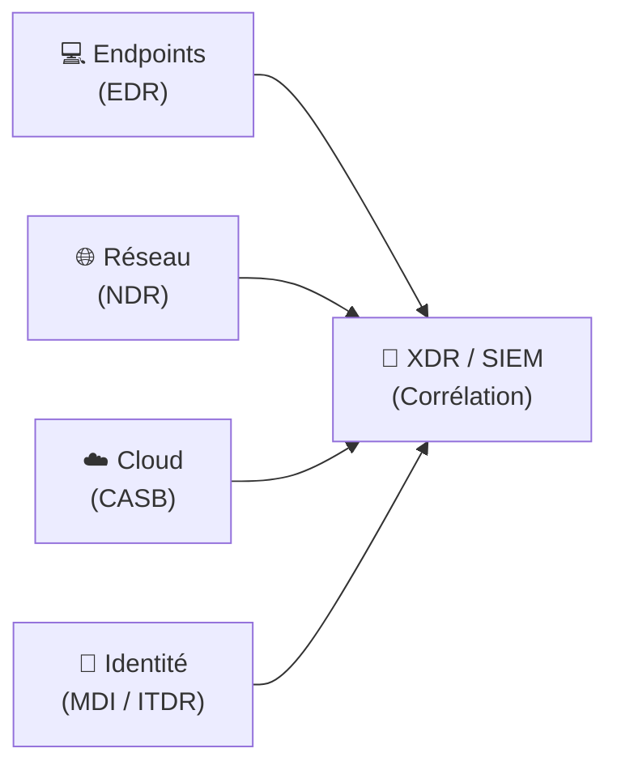

---
tags:
  - Cybersecurite
  - NDR
  - Reseau
---

# NDR (Network Detection and Response)

Le **NDR** se concentre sur ce que les autres outils ne voient pas : **le trafic réseau**. Un attaquant peut compromettre un endpoint sans toucher un seul fichier (attaque *fileless*), mais il doit forcément **communiquer sur le réseau** pour exfiltrer des données, recevoir des ordres depuis son C2 (*Command & Control*), ou se déplacer latéralement. C'est là que le NDR excelle.

## Principe de fonctionnement

Le NDR analyse le **trafic réseau en temps réel** (et/ou les métadonnées de flux) depuis des points de capture stratégiques sur le réseau (TAP, SPAN port, sondes inline).

Il utilise plusieurs techniques de détection combinées :

| Technique | Description |
| :--- | :--- |
| **Analyse des métadonnées de flux (NetFlow/IPFIX)** | Qui communique avec qui, sur quel port, depuis combien de temps et quel volume ? Sans déchiffrer le contenu. |
| **DPI (Deep Packet Inspection)** | Analyse le contenu des paquets non chiffrés pour identifier les protocoles et les comportements malveillants. |
| **Machine Learning (ML)** | Établit une référence du comportement réseau normal (*baselining*) et alerte sur toute déviation statistique. |
| **Analyse des certificats TLS** | Même le trafic chiffré laisse des traces : le certificat, le JA3/JA3S fingerprint, la durée de session... |
| **Détection de C2 (Command & Control)** | Identifie les beaconing (communications régulières et discrètes) et les domaines générés par DGA (*Domain Generation Algorithm*). |

## Ce que le NDR détecte que l'EDR manque

Un EDR ne voit que ce qui se passe **sur la machine où il est installé**. Il ne peut pas surveiller :
* Les objets réseau (IoT, imprimantes, équipements industriels OT/ICS) qui n'acceptent pas d'agent.
* Le trafic entre deux serveurs sur le réseau interne (*East-West Traffic*).
* La communication d'un endpoint compromis vers un serveur C2 (si l'agent EDR a été tué).

## Positionnement dans l'architecture de sécurité

Le NDR est complémentaire à l'[EDR](edr.md) et s'intègre dans une stratégie [XDR](xdr.md) ou remonte ses alertes vers le [SIEM](siem.md).

## Exemples de NDR du marché

* **Darktrace** : Pionnier du ML appliqué à la sécurité réseau, modèle "IA autonome".
* **ExtraHop Reveal(x)** : Très puissant sur la couche réseau, analyse le trafic Cloud et on-premise.
* **Cisco Secure Network Analytics (ex-Stealthwatch)** : S'appuie sur les flux NetFlow existants.
* **Vectra AI** : Spécialisé dans la détection des mouvements latéraux et des attaques sur identité.
* **Corelight** : Basé sur Zeek (open-source), très apprécié des SOC avancés.

## Résumé : EDR / NDR / SIEM / XDR

| Solution | Quoi surveille-t-il ? | Point aveugle principal |
| :--- | :--- | :--- |
| [EDR](edr.md) | Le point de terminaison (fichiers, processus, mémoire) | Le réseau, les équipements sans agent |
| **NDR** | Le trafic réseau (flux, paquets) | Ce qui se passe dans la mémoire d'un endpoint |
| [SIEM](siem.md) | Les logs de toute l'infrastructure | La visibilité en temps réel (trop de volume) |
| [XDR](xdr.md) | Toutes les sources corrélées | Dépend des sources intégrées |
