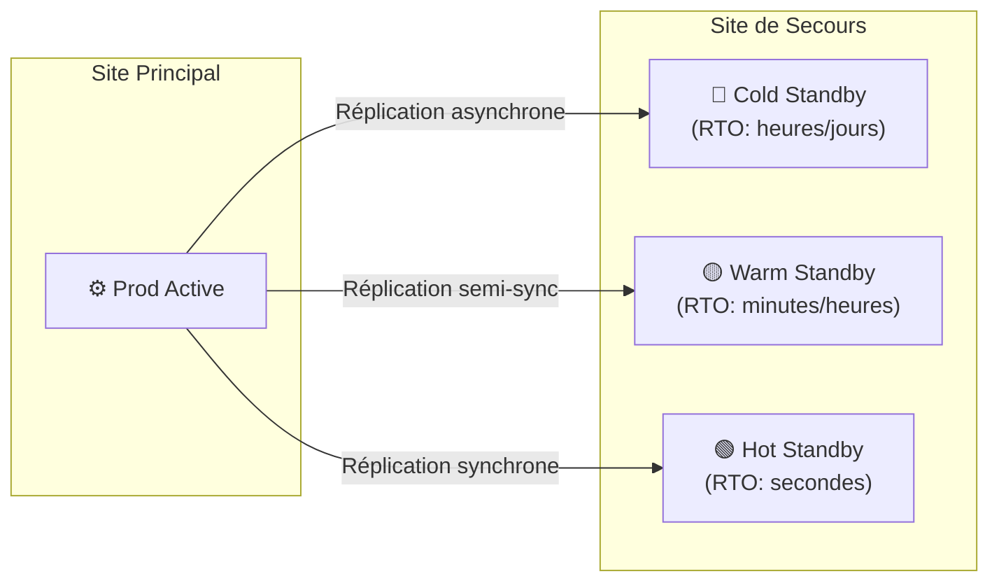

---
tags:
  - Cybersecurite
  - Gouvernance
  - Continuité
  - PCA
  - PRA
---

# PCA et PRA (Continuité et Reprise d'Activité)

Dispositifs stratégiques et techniques permettant à une organisation de survivre à une crise majeure.

## 1. Définition
Le **PCA** (Plan de Continuité d'Activité) et le **PRA** (Plan de Reprise d'Activité) sont deux plans complémentaires qui permettent à une organisation de faire face à une crise majeure (cyberattaque, incendie, panne de datacenter) et de s'en remettre.
* **PCA** : Maintenir l'activité *pendant* la crise ("Ne jamais s'arrêter").
* **PRA** : Rétablir l'activité *après* la crise ("Redémarrer le plus vite possible").

## 2. Description / Fonctionnement
Le PCA repose sur de la **redondance** et du basculement automatique (serveurs en cluster actif/actif ou actif/passif sur un site de secours).
Le PRA s'appuie essentiellement sur les **sauvegardes** pour restaurer les systèmes progressivement.

Ces plans définissent des indicateurs clés après une analyse d'impact (BIA) :
* **RTO (Recovery Time Objective)** : Durée maximale d'interruption tolérable (ex: 4h).
* **RPO (Recovery Point Objective)** : Perte de données maximale acceptable (ex: sauvegarde toutes les heures = RPO d'1h).
* **MTPD (Maximum Tolerable Period of Disruption)** : Durée max avant impact irréversible.

## 3. Utilisation / Cas Pratique
Le dispositif est activé par une **Cellule de crise** (DSI, RSSI, Communication, Métiers) dès qu'un incident critique est déclaré. Le PCA prend le relais immédiatement. S'il échoue (ou s'il s'agit d'un ransomware qui a chiffré les deux sites), le PRA est déclenché pour restaurer l'infrastructure de base (Active Directory, DNS) puis les systèmes métiers prioritaires.

## 4. Modifications possibles / Alternatives
Les architectures varient selon le budget :
* **Cold Standby** (PRA lent, peu coûteux).
* **Warm Standby** (Restauration en quelques heures).
* **Hot Standby / Actif-Actif** (PCA immédiat, extrêmement coûteux).
> [!IMPORTANT]
> Un PCA/PRA doit être obligatoirement testé (tests de basculement, exercices de crise). Un plan non testé ne fonctionnera pas le jour J.

## 5. Exemples visuels et Liens utiles

