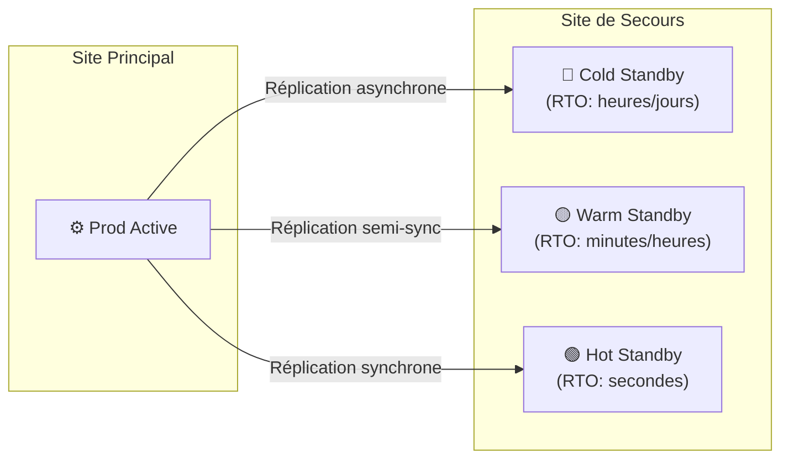

---
tags:
  - Cybersecurite
  - Gouvernance
  - Continuité
  - PCA
  - PRA
---

# PCA et PRA — Plan de Continuité et de Reprise d'Activité

Le **PCA** (Plan de Continuité d'Activité) et le **PRA** (Plan de Reprise d'Activité) sont deux plans complémentaires qui permettent à une organisation de faire face à une crise majeure (cyberattaque, sinistre, pandémie, panne critique...) et de s'en remettre.

## PCA vs PRA : quelle différence ?

| | PCA | PRA |
| :--- | :--- | :--- |
| **Objectif** | Maintenir l'activité **pendant** la crise | Rétablir l'activité **après** la crise |
| **Paradigme** | "Ne jamais s'arrêter" | "Redémarrer le plus vite possible" |
| **Technologie** | Redondance, basculement automatique (failover) | Restauration depuis [sauvegardes](../Systeme/Services/sauvegarde.md) |
| **Coût** | Élevé (infrastructure dupliquée) | Modéré (selon les RPO/RTO) |
| **Exemples** | Cluster HA, site de secours actif/actif | Restauration Veeam, site de secours à froid |

> Un bon dispositif combine les deux : le **PCA** prend le relais immédiatement et le **PRA** structure la remontée complète en cas d'échec du PCA ou de sinistre total.

---

## PCA — Plan de Continuité d'Activité

### Concept

Le PCA vise à maintenir les **fonctions essentielles de l'organisme** même en cas de défaillance majeure. Il repose sur :

* **L'identification des activités critiques** (BIA — Business Impact Analysis)
* **La mise en œuvre de solutions de redondance** techniques et organisationnelles
* **Des procédures de basculement** (failover) définies, testées et documentées

### BIA — Analyse d'Impact sur l'Activité

Avant de rédiger un PCA, il faut réaliser un **BIA** pour répondre à ces questions :

| Question | Réponse attendue |
| :--- | :--- |
| Quelles activités sont critiques ? | Liste des processus métier essentiels |
| Quel est l'impact d'une interruption ? | Financier, réglementaire, réputationnel |
| Pendant combien de temps peut-on s'arrêter ? | Définit le **RTO** |
| Jusqu'à quelle date peut-on perdre des données ? | Définit le **RPO** |

### Indicateurs clés

| Indicateur | Définition | Exemple |
| :--- | :--- | :--- |
| **RTO** (Recovery Time Objective) | Durée maximale d'interruption tolérable | RTO = 4h → le service doit être rétabli en 4h |
| **RPO** (Recovery Point Objective) | Perte de données maximale acceptable | RPO = 1h → sauvegarde toutes les heures |
| **MTPD** (Maximum Tolerable Period of Disruption) | Durée max avant impact irréversible | MTPD = 24h → au-delà, l'organisme ne s'en remet plus |

### Architectures de continuité

| Mode | Délai de basculement | Coût |
| :--- | :---: | :---: |
| **Cold Standby** | Heures à jours | Faible |
| **Warm Standby** | Minutes à heures | Modéré |
| **Hot Standby (Actif/Passif)** | Secondes | Élevé |
| **Actif/Actif** | Quasi immédiat | Très élevé |

---

## PRA — Plan de Reprise d'Activité

### Concept

Le PRA est le plan "d'urgence" qui décrit **comment restaurer les services après un sinistre** lorsque le PCA ne peut plus maintenir l'activité (sinistre total, ransomware chiffrant le site principal et le site de secours...).

Il s'appuie essentiellement sur la politique de [sauvegarde](../Systeme/Services/sauvegarde.md) et définit :
* L'ordre de priorité de restauration des systèmes
* Les procédures techniques de restauration
* Les responsables et leurs suppléants
* Les contacts d'urgence (prestataires, hébergeurs, assureurs cyber...)

### Ordre de priorité de restauration

1. **Infrastructure de base** : Active Directory, DNS, DHCP — sans eux, rien ne fonctionne
2. **Messagerie et communication** : La coordination de crise en dépend
3. **Systèmes métier critiques** : ERP, DPI (santé), applicatifs de facturation
4. **Systèmes secondaires** : Intranet, outils collaboratifs, archives
5. **Postes de travail utilisateurs**

### Cellule de crise

Un PCA/PRA efficace prévoit une **cellule de crise** activée dès le début de l'incident :

| Rôle | Responsabilité |
| :--- | :--- |
| **DSI / Directeur de crise IT** | Coordination technique globale |
| **RSSI** | Qualification de l'incident, interface avec les autorités (ANSSI, CNIL) |
| **Référents métier** | Priorisation des besoins fonctionnels |
| **Communication** | Messages internes et externes, gestion de la réputation |
| **Juridique** | Obligations légales (notification CNIL sous 72h si données personnelles) |

## Tester le PCA/PRA

> [!IMPORTANT]
> Un plan non testé est un plan qui ne fonctionnera pas en cas de crise. L'ANSSI recommande des exercices réguliers.

* **Test de sauvegarde/restauration** : Valider que les sauvegardes sont exploitables
* **Test de basculement** : Simuler la perte du site principal et le basculement sur le site de secours
* **Exercice de table** : Simulation de crise avec la cellule de crise (sans impact technique)
* **Test grandeur nature** : Bascule réelle en dehors des heures de production
