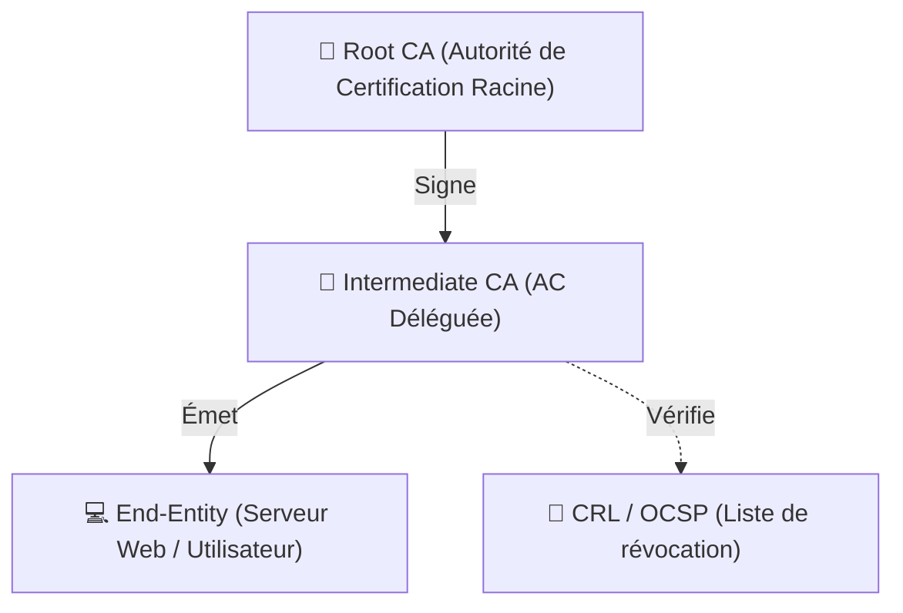

---
tags:
  - Cybersecurite
  - Cryptographie
  - Pki
  - Securite
---

# Cryptographie, Certificats et PKI

Principes fondamentaux de protection de la donnée et de vérification des identités numériques.

---

## 1. Cryptographie Symétrique et Asymétrique

### 1.1. Définition
La cryptographie est l'art de chiffrer un message clair pour le rendre inintelligible. L'informatique moderne repose sur deux grandes familles : la cryptographie **symétrique** et **asymétrique**.

### 1.2. Description / Fonctionnement
* **Symétrique** : Utilise *une seule et même clé secrète* pour chiffrer et déchiffrer la donnée. Elle est extrêmement rapide (idéale pour la data volumineuse avec AES). Son défaut majeur est la distribution de la clé : comment l'envoyer secrètement au destinataire distant sur Internet ?
* **Asymétrique** : Utilise une paire de clés mathématiquement liées (*Publique / Privée*). Ce qui est chiffré par l'une ne peut être déchiffré que par l'autre. La clé publique est diffusée à tous sans danger, la privée est gardée secrète. Elle résout le problème d'échange de clé mais reste lente.

### 1.3. Utilisation / Cas Pratique
Sur Internet (le Web HTTPS/TLS), on utilise un système **hybride** : l'asymétrique (lent) est utilisé au tout début de la connexion pour permettre aux deux ordinateurs d'échanger une clé symétrique de manière sécurisée. Ensuite, tout le reste de la session Web s'effectue en symétrique (bien plus rapide).

### 1.4. Modifications possibles / Alternatives
L'informatique quantique menace de casser à terme les algorithmes asymétriques actuels (RSA, Elliptic Curves). L'alternative d'avenir sur laquelle l'industrie travaille est la **cryptographie post-quantique**.

### 1.5. Exemples visuels et Liens utiles
*(Ajouter un schéma d'échange de clés asymétriques entre Alice et Bob).*

---

## 2. Certificats Numériques (X.509)

### 2.1. Définition
Un certificat numérique (au standard X.509) est une "carte d'identité" numérique inviolable qui lie formellement une entité (un nom de domaine, une entreprise, un utilisateur) à sa propre clé publique.

### 2.2. Description / Fonctionnement
La cryptographie asymétrique a une faille conceptuelle : l'attaque "Man-in-the-Middle" (quelqu'un se fait passer pour le serveur et donne sa propre clé publique à la place). Le certificat numérique empêche cela. Il contient l'identité du serveur, sa clé publique, sa date de validité, et surtout **la signature cryptographique** d'une autorité de confiance supérieure certifiant que "cette clé appartient bien à cette identité".

### 2.3. Utilisation / Cas Pratique
Lorsqu'un utilisateur navigue sur `https://impots.gouv.fr`, le serveur présente son certificat. Le navigateur de l'utilisateur vérifie cryptographiquement la signature de ce certificat. Si la signature est valide et de confiance, il affiche le "cadenas sécurisé".

### 2.4. Modifications possibles / Alternatives
Il n'existe pas d'alternative majeure ou de concurrent au standard X.509 aujourd'hui sur le web mondial.

### 2.5. Exemples visuels et Liens utiles
Vous pouvez cliquer sur le petit cadenas dans la barre d'adresse de votre navigateur pour visualiser le certificat du site actuel et voir qui a signé l'identité du site.

---

## 3. PKI (Public Key Infrastructure)

### 3.1. Définition
La PKI est l'infrastructure complète (comprenant les serveurs, les algorithmes, et les procédures humaines strictes) qui permet de créer, distribuer, gérer et révoquer les certificats numériques.

### 3.2. Description / Fonctionnement
Au cœur de toute PKI se trouve l'**Autorité de Certification (CA - Certificate Authority)**. C'est elle qui vérifie l'identité du demandeur et qui appose sa signature sur le certificat.
Il existe de grandes CA publiques (*Let's Encrypt, DigiCert*) dont le certificat racine est reconnu mondialement et intégré nativement dans tous les PC et smartphones de la planète.

### 3.3. Utilisation / Cas Pratique
Les grandes entreprises déploient généralement leur propre PKI interne (CA privée) via Microsoft Active Directory Certificate Services (AD CS). Cela permet de générer des certificats internes (gratuits) pour sécuriser l'Intranet, le réseau Wi-Fi d'entreprise (802.1X) ou le VPN des employés.

### 3.4. Modifications possibles / Alternatives
Gérer une PKI d'entreprise est une tâche d'ingénierie complexe et critique (notamment la gestion des "CRL" pour révoquer les certificats volés). Aujourd'hui, les architectures modernes de type **Zero Trust** s'appuient massivement sur la PKI pour vérifier l'identité de chaque appareil à chaque connexion réseau.

### 3.5. Exemples visuels et Liens utiles

