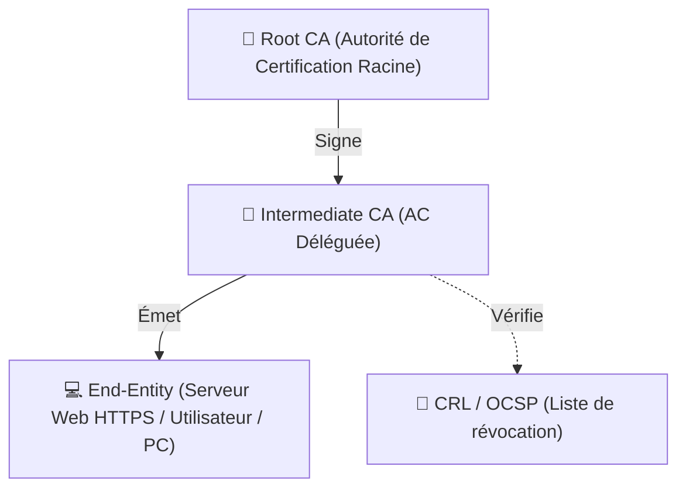

---
tags:
  - Cybersecurite
  - Cryptographie
  - Pki
  - Securite
---

# Cryptographie, Certificats et PKI

## Concepts Fondamentaux de Cryptographie

### Cryptographie Symétrique
* Utilise **une seule et même clé** (clé secrète) pour chiffrer **et** déchiffrer la donnée.
* Extrêmement rapide : idéale pour chiffrer massivement des données (disques durs, payload réseau VPN IPSec/TLS).
* Protocole dominant : **[AES (Advanced Encryption Standard)](https://fr.wikipedia.org/wiki/Advanced_Encryption_Standard)** (AES-128, AES-256).
* **Le problème** : La distribution de la clé. Comment envoyer la clé secrète au destinataire sur Internet sans qu'elle soit interceptée ?

### Cryptographie Asymétrique (à clé publique)
Résout le problème de distribution de la clé secrète. Génération d'une paire mathématiquement liée :
1. **Clé publique** : Diffusée publiquement (à tout le monde).
2. **Clé privée** : Strictement secrète et conservée localement, **jamais transmise**.

* **Le principe (Chiffrement)** : Tout ce qui est chiffré avec la clé publique d'une personne, ne peut être déchiffré **que** par sa clé privée. Donc on confie notre clé publique à tout Internet. Si Alice veut écrire à Bob, Alice chiffre le message avec la clé publique de Bob. Seul Bob peut le lire.
* **Le principe (Signature)** : Tout ce qui a été chiffré par la clé privée de Bob ne peut être vérifié que par la clé publique de Bob. C'est l'inverse : Bob chiffre l'empreinte de son contrat avec sa clé secrète. On lit le contrat en utilisant sa clé publique. On prouve ainsi que seul Bob (le possesseur de la clé privée) a rédigé le document (Non-répudiation).
* Protocoles : **RSA**, courbes elliptiques (ECDH), Diffie-Hellman.

---

## Les Certificats Numériques (X.509)

La cryptographie asymétrique a elle aussi une faille critique : l'**attaque Man-in-the-Middle**.
Si un attaquant intercepte la demande de clé publique, il peut fournir *sa propre clé publique* à la victime en se faisant passer pour un site (ex: fausse clé du site impots.gouv.fr). Comment garantir que la clé publique appartient bien au véritable serveur ? **Grâce aux certificats**.

Un **Certificat numérique (standard X.509)** est une carte d'identité inviolable qui lie une identité (Un FQDN de serveur, une entreprise...) à un jeu de clés asymétriques.

Un certificat inclut :
* L'identité du propriétaire (ex: www.monsite.com, Google LLC...)
* Sa **clé publique**
* La date d'expiration
* Qui a émis le certificat (L'Autorité de Certification)
* **La signature électronique de l'Autorité qui prouve la validité de l'ensemble.**

---

## Infrastructure à Clés Publiques (PKI)

La **PKI (Public Key Infrastructure)** est le système physique, procédural et humain qui permet de créer, distribuer, gérer et révoquer ces certificats numériques.

### 1. L'Autorité de Certification (CA - Certificate Authority)

C'est l'ordinateur serveur, ou le service tiers très sécurisé, chargé de vérifier l'identité du demandeur de certificat. S'il valide, le composant CA va apposer **sa propre signature (chiffrement par sa clé privée hyper-référente)** sur la demande du client, émettant ainsi le certificat final du client.

* **Exemples de CA Publics** mondiaux par défaut fournis dans les PC/Mac/iOS/Android : *DigiCert, Let's Encrypt, GlobalSign, IdenTrust.*
* **CA Privé (PKI d'entreprise)** : Une entreprise gère un serveur "AD CS" (Active Directory Certificate Services) interne pour émettre ses propres cartes d'identité numériques, afin de sécuriser le réseau local interne (Wi-Fi 802.1X, VPN, sites webs intranet). Cette CA racine de l'entreprise est déployée manuellement par GPO sur tous les PCs locaux pour qu'ils lui fassent tous nativement confiance.

### 2. Le fonctionnement Pratique du TLS / HTTPS sur le Web

1. **Le client** "John" accède via son navigateur Chrome à `https://www.site-secure.com`
2. **Le serveur** `site-secure.com` présente son certificat X.509 à John (comportant sa clé publique, son nom, l'identité du CA qui a signé, et les dates de durée de vie).
3. **Le navigateur client Chrome** inspecte le certificat. Il lit que "Let's Encrypt" a apposé sa signature dessus. Chrome va fouiller dans le "Root Store" local de l'OS Microsoft Windows (ou l'OS Apple de la machine de John) pour vérifier s'il fait confiance, par défaut, à "Let's Encrypt".
4. "Let's Encrypt" est préinstallé globalement sur tous les PCs du monde moderne. C'est le cas. Le PC client effectue alors de savants calculs cryptographiques ("Déchiffrer la signature serveur avec la clé de Let's Encrypt stockée localement dans l'OS"). Les mathématiques sont exactes. La validité (la non répudiation) du site `site-secure.com` est validée. Le navigateur dit OK vert (Sécurisé/Cadenas plein).
5. **Session hybride** : Le navigateur génère une clé SECRÈTE DE SESSION **symétrique (super super rapide en AES!!)** qu'il chiffre asymétriquement avec **la clé publique du serveur lue dans le certificat**.
6. Le serveur reçoit cette donnée codée illisible, qu'il décrypte secrètement avec sa propre clé privée (lui seul sur la planète, avec son vrai hardware derrière, détient la clé privée qui décrypte !). Le serveur "absorbe" / "comprend" la proposition de session rapide avec AES faite par John.
7. Dès cet instant précis, sur un canevas sécurisé, le **Trafic Bidirectionnel applicatif de HTTPS peut échanger les vraies données à pleine vitesse, encryptées globalement en symétrique.**
