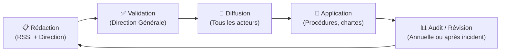

---
tags:
  - Cybersecurite
  - Gouvernance
  - PSSI
---

# PSSI (Politique de Sécurité des Systèmes d'Information)

Document fondateur exprimant la vision stratégique de la direction en matière de sécurité de l'information.

## 1. Définition
La PSSI (Politique de Sécurité des Systèmes d'Information) est le document fondateur de la gouvernance de la sécurité dans un organisme. Elle exprime la vision stratégique de la direction et définit les grandes règles que tous les acteurs (employés, sous-traitants, prestataires) doivent respecter.

## 2. Description / Fonctionnement
La sécurité de l'information repose sur 4 piliers (DICP) que la PSSI cherche à garantir :
* **D**isponibilité : Le SI est accessible quand on en a besoin.
* **I**ntégrité : Les données ne sont pas altérées.
* **C**onfidentialité : Les données ne sont accessibles qu'aux personnes autorisées.
* **P**reuve (Traçabilité) : Les actions sont journalisées et non répudiables.

La PSSI contient typiquement :
* **Contexte et enjeux** : Missions, actifs à protéger, réglementation (RGPD, HDS...).
* **Périmètre** : Systèmes, sites et utilisateurs concernés.
* **Principes directeurs** : Moindre privilège, défense en profondeur, besoin d'en connaître.
* **Organisation** : Rôle du RSSI, comité de pilotage, gestion des incidents.
* **Exigences par domaine** : Accès, sécurité physique, sauvegardes, tiers, sensibilisation.

## 3. Utilisation / Cas Pratique
La PSSI est approuvée et signée par la **Direction Générale**. C'est un document de gouvernance (non technique) qui sert de référence absolue en cas de litige, d'audit ou d'incident. 
Sa déclinaison opérationnelle se fait ensuite dans des procédures, chartes informatiques et guides techniques.

## 4. Modifications possibles / Alternatives
La PSSI n'est pas un document figé. Son cycle de vie implique une révision régulière (annuelle ou suite à un incident majeur). Dans certains secteurs, la PSSI est déclinée en versions spécifiques pour s'adapter aux contraintes métiers (ex: la PGSSI-S pour le secteur de la santé en France).

## 5. Exemples visuels et Liens utiles

### Cycle de vie d'une PSSI

### Lien avec d'autres référentiels
* [ISO 27001](normes_reglementation.md) : La PSSI est l'un des livrables centraux.
* [EBIOS RM](ebios.md) : L'analyse de risques justifie les choix de la PSSI.
* [PCA / PRA](pca_pra.md) : Déclinaison de la politique de continuité.
