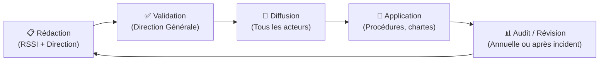

---
tags:
  - Cybersecurite
  - Gouvernance
  - PSSI
---

# PSSI — Politique de Sécurité des Systèmes d'Information

La **PSSI** est le document fondateur de la gouvernance de la sécurité dans un organisme. Elle exprime la **vision stratégique de la direction** en matière de sécurité de l'information et définit les grandes règles que tous les acteurs (employés, sous-traitants, prestataires) doivent respecter.

> [!IMPORTANT]
> La PSSI est un **document de gouvernance**, pas un document technique. Elle est approuvée et signée par la **Direction Générale**, qui en est responsable. Sa déclinaison opérationnelle se fait ensuite dans des **procédures**, **chartes** et **guides techniques**.

## Contenu typique d'une PSSI

### 1. Contexte et enjeux
* Rappel des missions et des activités de l'organisme
* Identification des actifs à protéger (données sensibles, systèmes critiques, patrimoine informationnel)
* Contexte réglementaire applicable (RGPD, LPM, HDS, secteur d'activité...)

### 2. Périmètre
Définit clairement ce qui est concerné par la politique : quels systèmes, quels sites, quels utilisateurs, quels tiers.

### 3. Principes directeurs
Les grandes lignes de conduite, par exemple :
* **Principe de moindre privilège** : Chaque utilisateur ne dispose que des droits strictement nécessaires à sa mission.
* **Défense en profondeur** : Superposer plusieurs couches de sécurité.
* **Besoin d'en connaître** : L'information ne circule qu'entre les personnes qui en ont besoin.

### 4. Objectifs de sécurité (DICP)
La sécurité de l'information repose sur 4 piliers :

| Pilier | Signification | Exemple de menace |
| :---: | :--- | :--- |
| **D**isponibilité | Le SI est accessible quand on en a besoin | DDoS, panne matérielle |
| **I**ntégrité | Les données ne sont pas altérées | Falsification, corruption |
| **C**onfidentialité | Les données ne sont accessibles qu'aux personnes autorisées | Fuite, espionnage |
| **P**reuve (Traçabilité) | Les actions sont journalisées et non répudiables | Effacement de logs |

### 5. Organisation de la sécurité
* Rôle et responsabilités du **RSSI** (Responsable de la Sécurité des SI)
* Comité de pilotage sécurité
* Processus de gestion des incidents

### 6. Exigences par domaine
La PSSI fixe les règles de haut niveau pour chaque domaine :
* Gestion des accès et des identités
* Sécurité physique
* Sauvegarde et continuité
* Gestion des tiers et des contrats (clause sécurité)
* Sensibilisation et formation des utilisateurs

## Cycle de vie d'une PSSI

## Lien avec d'autres référentiels

| Document | Relation avec la PSSI |
| :--- | :--- |
| [ISO 27001](normes_reglementation.md) | La PSSI est l'un des livrables centraux du SMSI ISO 27001 |
| [EBIOS RM](ebios.md) | L'analyse de risques alimente et justifie les choix de la PSSI |
| [PCA / PRA](pca_pra.md) | Déclinaison opérationnelle de la politique de continuité |
| [PGSSI-S](pgssi_s.md) | Version sectorielle pour les établissements de santé |
