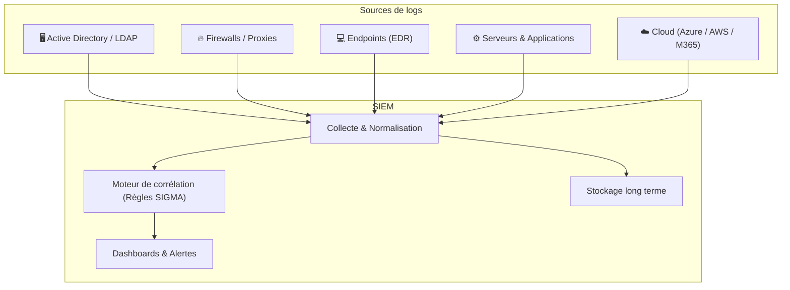

---
tags:
  - Cybersecurite
  - SIEM
  - SOC
---

# SIEM (Security Information and Event Management)

Le **SIEM** est la **tour de contrôle centralisée du SOC** (*Security Operations Center*). Il ingère, normalise et corrèle les journaux (*logs*) de l'ensemble de l'infrastructure pour détecter les menaces et prouver la conformité réglementaire.

## Deux fonctions fondamentales

### 1. SIM (Security Information Management) — La mémoire
Collecte, stocke et archive à long terme les logs de toutes les sources (Active Directory, firewall, serveurs, applications...). Cette rétention est souvent imposée par la réglementation (ex: **12 mois** selon la LPM, **5 ans** pour les données bancaires).

### 2. SEM (Security Event Management) — Les yeux
Analyse les logs en temps réel à la recherche d'événements anormaux via des **règles de corrélation** (ex : "Si un utilisateur se connecte de deux pays différents en moins de 30 minutes → Alerte Impossible Travel").

## Architecture d'un SIEM

## Cas d'usage concrets

* **Détection de Brute Force** : Plus de 10 échecs de connexion sur le même compte en 1 minute → Alerte.
* **Impossible Travel** : Connexion depuis Paris à 9h et depuis Tokyo à 9h15 pour le même compte → Alerte.
* **Exfiltration de données** : Volume de données sortant anormalement élevé depuis un poste.
* **Escalade de privilèges** : Compte standard qui rejoint le groupe "Domain Admins" à 3h du matin.
* **Conformité** : Preuve que les logs de connexion sont conservés depuis N mois (audit CNIL, SOX, PCI-DSS...).

## SOAR : L'automatisation au-dessus du SIEM

Le **SOAR** (*Security Orchestration, Automation and Response*) est souvent associé ou intégré au SIEM. Il permet d'**automatiser les réponses** aux alertes via des "playbooks" (ex: "Si Alerte Brute Force → Bloquer automatiquement le compte + envoyer un email à l'IT + ouvrir un ticket ITSM").

## Exemples de SIEM du marché

| Produit | Éditeur | Positionnement |
| :--- | :--- | :--- |
| **Microsoft Sentinel** | Microsoft | Cloud-native (Azure), excellent pour M365 |
| **Splunk** | Cisco | Leader historique, très puissant mais cher |
| **IBM QRadar** | IBM | Référence Enterprise, on-premise ou cloud |
| **Elastic SIEM** | Elastic | Open-source & flexible, self-hosted |
| **Wazuh** | Open-source | Alternative libre très utilisée en PME |
