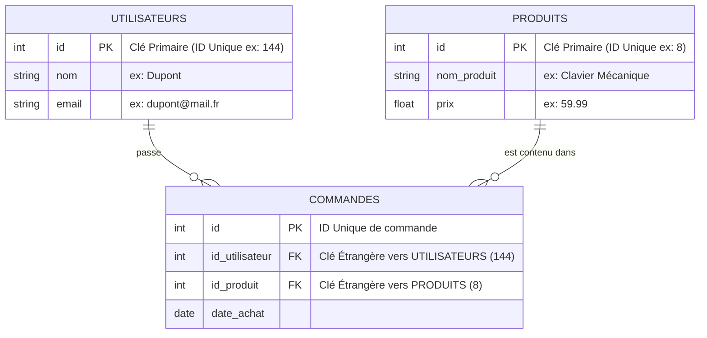

---
tags:
  - Developpement
  - Bases_de_donnees
  - SQL
---

# Bases de Données (SQL)

Cette page sert d'aide-mémoire pour préparer, structurer et utiliser des bases de données relationnelles avec le langage SQL.

## 1. Définition
Un **SGBDR** (Système de Gestion de Bases de Données Relationnelles) est un logiciel serveur puissant dont le seul but est de stocker, trier et sécuriser des millions de données de manière logique et fiable. 
L'immense majorité des SGBDR utilise le langage standardisé **SQL** (*Structured Query Language*) pour interroger et modifier ces données. Le moteur open-source le plus célèbre et utilisé sur le web est **MySQL**, dont le dérivé libre et très performant est **MariaDB**.

## 2. Description / Fonctionnement
L'architecture relationnelle s'articule autour de concepts très stricts, semblables à un immense fichier Excel dont les pages seraient interconnectées :
* **La Base de Données (Database)** : Le grand conteneur global du projet (ex: `boutique_ecommerce`).
* **La Table** : Une "feuille de calcul" thématique dans la base (ex: Une table `Utilisateurs`, une table `Commandes`, une table `Produits`).
* **Les Colonnes (Champs)** : Les attributs définis à l'avance pour la table (ex: *Nom*, *Email*, *Prix*). Une colonne ne peut contenir qu'un seul type précis de donnée (Texte, Entier, Date).
* **Les Lignes (Enregistrements)** : Une entrée unique contenant des données pour chaque colonne.
* **La Clé Primaire (L'ID - Identifiant Unique)** : C'est le concept central du SQL. Chaque ligne DOIT posséder un numéro d'identification unique, qui s'incrémente tout seul à chaque nouvelle ligne (ex: ID `144`). C'est la plaque d'immatriculation infalsifiable de l'enregistrement.
* **La Clé Étrangère (Foreign Key)** : C'est ce qui crée la *relation* entre les tables. La table `Commandes` ne stockera pas directement le prénom et le nom du client (ça prendrait trop de place et créerait des erreurs), elle stockera uniquement l'ID du client (ex: *L'utilisateur ID `144` a acheté le produit ID `8`*). 

## 3. Utilisation / Cas Pratique
Lorsqu'un visiteur charge son panier sur un site e-commerce, le code PHP ou Python du site web se connecte au serveur MariaDB et lui envoie une requête textuelle SQL :
*"Trouve-moi toutes les lignes dans la table `Commandes` où l'ID Client est égal à 144, et inclus (grâce à une Jointure SQL) le vrai nom des produits correspondants situés dans la table `Produits`."*
Le serveur MariaDB lit ses disques extrêmement rapidement (grâce à la magie des "Index"), croise les tables, et renvoie le tableau final au site web.

## 4. Modifications possibles / Alternatives
**Alternatives Relationnelles (Bases SQL) :**
* **PostgreSQL** : Très apprécié dans l'industrie logicielle pour sa rigueur stricte, sa fiabilité et ses fonctionnalités de données très avancées. L'étoile montante.
* **Microsoft SQL Server / Oracle DB** : Les mastodontes commerciaux surpuissants mais très coûteux pour les très grandes entreprises.
* **SQLite** : Une base de données légère tenant dans un seul fichier texte, géniale pour les développeurs, le prototypage ou les applications mobiles.

**Le monde du NoSQL (Non-Relationnel) :**
Lorsque les données sont trop chaotiques (pas de colonnes fixes possibles) ou nécessitent une scalabilité mondiale répartie sur des centaines de serveurs (Big Data / Réseaux Sociaux), on utilise des SGBD dits "NoSQL". Ils fonctionnent souvent sous forme de documents au format JSON libre (Les leaders sont **MongoDB**, **Cassandra**, **Redis**).

## 5. Exemples visuels et Liens utiles

### Architecture relationnelle simple

`Voir aussi : [Mémento SQL](commande_sql.md) | [Sécurisation de la BDD](securite_bdd.md)`
