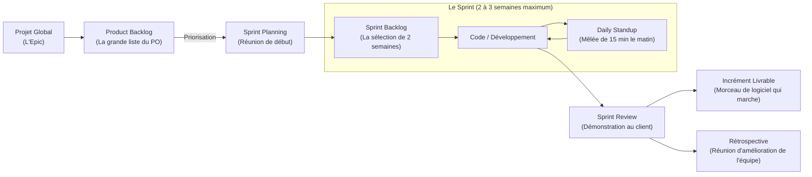

---
tags:
  - Management
  - Gestion_de_projet
  - Agile
  - Scrum
  - Sprint
---

# L'Approche Agile et le framework Scrum

La méthode de gestion de projet adaptative, itérative et intensément centrée sur la valeur utilisateur.

## 1. Définition
La méthode **Agile** n'est pas une méthodologie stricte gravée dans le marbre, mais une véritable philosophie de gestion de projet (née du Manifeste Agile de 2001). Elle prône l'adaptabilité permanente, la collaboration étroite avec le client et des livraisons de code très rapides. 
Le framework **Scrum** est la déclinaison pratique la plus célèbre et la plus utilisée dans le monde logiciel pour appliquer cette philosophie. Il organise le travail d'une équipe en cycles courts et intenses appelés des **Sprints**.

## 2. Description / Fonctionnement

Le vocabulaire essentiel d'un projet géré en Agile / Scrum :
* **L'Epic** : Un gigantesque besoin métier ou projet global (ex: "Créer un nouveau portail e-commerce"). Il est beaucoup trop gros pour être réalisé en une seule fois par les développeurs.
* **La User Story (US)** : C'est le découpage de l'Epic en tout petits morceaux. La tâche est rédigée du point de vue de l'utilisateur final. (ex: *"En tant que client, je veux pouvoir filtrer les articles par prix, afin de trouver les moins chers"*). Elle doit être réalisable par un développeur en quelques jours maximum.
* **Le Backlog (Product Backlog)** : C'est la grande liste de courses priorisée contenant absolument toutes les User Stories que l'équipe devra développer un jour.
* **Le Sprint** : Un cycle d'effort très court (généralement 2 à 3 semaines). Au début du Sprint, l'équipe pioche les User Stories les plus importantes dans le Backlog, s'engage solennellement à les terminer, et refuse de prendre du nouveau travail pendant ces 2 semaines. À la fin du Sprint, le logiciel doit être montré fonctionnel au client.

## 3. Utilisation / Cas Pratique
**Les Rôles Humains dans une équipe Scrum :**
* **Le Product Owner (PO)** : Le représentant des intérêts du client et du business. C'est lui qui rédige les *User Stories*, définit l'ordre de priorité strict dans le Backlog, et valide le travail des développeurs à la fin. C'est le décideur exclusif du "QUOI FAIRE".
* **Le Scrum Master** : C'est le coach et le facilitateur bienveillant. Il s'assure que l'équipe applique bien la méthode, anime les réunions de Sprint, et supprime les obstacles administratifs ou techniques qui bloqueraient les développeurs. Il n'est pas le chef, il ne donne pas d'ordres.
* **L'Équipe de Développement** : Ceux qui écrivent le code ou réalisent le projet. Ils sont totalement autonomes et décident eux-mêmes, sans l'avis du PO, du "COMMENT" réaliser techniquement les tâches.
* **Le Manager Agile** : (Rôle hors-Scrum) Dans les grandes entreprises, il chapeaute les équipes agiles, s'occupe des budgets, des congés, des carrières, mais n'intervient **plus du tout** dans la gestion des tâches quotidiennes de l'équipe (le Micro-management est formellement interdit en Agile).

## 4. Modifications possibles / Alternatives
Contrairement au [Cycle en V / Cascade](methodologies_projet.md) classique qui nécessite d'avoir un cahier des charges parfait au départ et de livrer 2 ans plus tard (avec le risque mortel que le besoin du marché ait changé), l'Agilité permet de changer d'avis et d'ajuster le tir à chaque fin de Sprint de 2 semaines.
**Alternatives courantes** : Si le rythme imposé des Sprints Scrum n'est pas adapté au contexte de l'entreprise (ex: pour une équipe de support informatique d'urgence), on préfèrera utiliser la méthode **Kanban** (un flux de travail continu et visuel avec des tickets limités). Pour les multinationales, on utilise des frameworks géants comme **SAFe** pour coordonner le travail de 20 équipes Scrum sur un même produit massif.

## 5. Exemples visuels et Liens utiles

### Le cycle de vie complet Scrum

`Voir aussi : [Méthodologies de Projet](methodologies_projet.md)`
