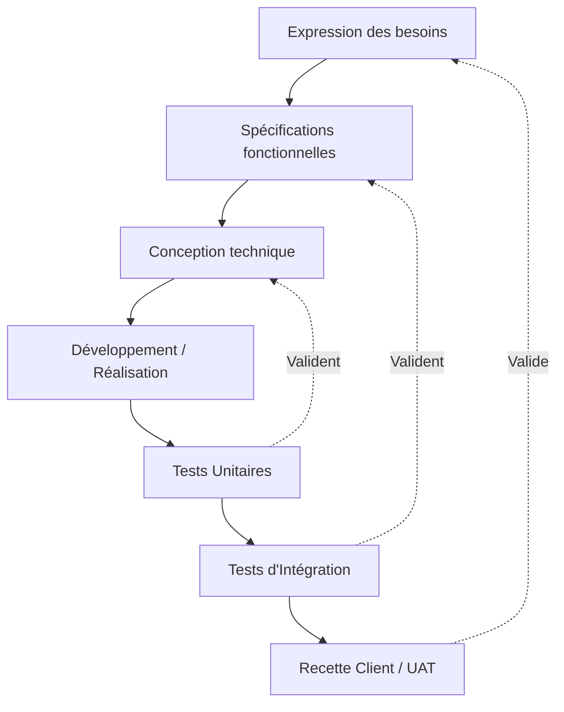

---
tags:
  - Management
  - Gestion_de_projet
  - Methodologies
  - Agile
  - PRINCE2
  - PMBOK
---

## 1. Définition
Les méthodologies dites **"Prédictives" (Traditionnelles)** partent du principe que le besoin du client final peut être parfaitement connu, analysé et figé dès le premier jour. Tout est donc documenté, budgétisé et planifié contractuellement avant même que le travail de réalisation ne commence. C'est l'opposé diamétral de l'approche empirique et itérative [Agile (Scrum)](agile_scrum.md).

## 2. Description / Fonctionnement (Les Grands Modèles)

### A. Le Modèle en Cascade (Waterfall)
Le tout premier modèle industriel et informatique. Les phases s'enchaînent de haut en bas comme une cascade d'eau (Le principe est qu'on ne remonte jamais en arrière).
1. *Cahier des charges* -> 2. *Architecture* -> 3. *Code/Fabrication* -> 4. *Tests globaux* -> 5. *Déploiement*.
**Le problème mortel :** Si une erreur de conception majeure est découverte très tardivement à l'étape 4 (Tests), la méthode ne permet pas de remonter facilement corriger l'étape 1, rendant le projet un échec financier.

### B. Le Cycle en V (V-Model)
C'est la correction moderne et l'amélioration majeure de la Cascade. Le projet "descend" dans le V pour la phase de conception, et "remonte" pour la phase de tests. 
Surtout, **chaque phase de conception descendante possède sa propre phase de test (validation) strictement correspondante en face**. 
Si on découvre un bug précis lors du *Test d'intégration*, on sait exactement qu'il faut corriger l'étape de *Conception technique détaillée* située juste en face sur la barre du V.

### C. La Méthode PRINCE2
PRINCE2 (*PRojects IN Controlled Environments*) n'est pas un dessin de cycle, c'est une méthode britannique très stricte de gouvernance de projet. Elle impose des rôles hiérarchiques précis (Le Comité de pilotage / *Project Board* qui valide les étapes par dessus le Chef de projet) et dicte très exactement qui doit signer quel document papier (les "Produits de Management") pour avoir le droit d'engager le budget de l'étape suivante.

## 3. Utilisation / Cas Pratique
Ces méthodes prédictives sont obligatoires et vitales dans l'industrie lourde (Aéronautique, Nucléaire, BTP, Appels d'offres publics).
*Cas Pratique* : On ne construit pas un Pont d'autoroute en méthode "Agile" (On ne livre pas un petit morceau de pont au-dessus du vide en demandant aux voitures si ça leur plaît pour améliorer la version 2). Tout doit être planifié et mathématiquement validé (*Cycle en V*) avant même de couler le premier pilier en béton.

## 4. Modifications possibles / Alternatives
Le grand défaut de toutes ces méthodes prédictives est **l'Effet Tunnel** : Le client signe le cahier des charges le 1er Janvier, l'équipe technique s'enferme et travaille "dans le noir" (dans le tunnel) pendant 1 an, et livre le logiciel d'un coup le 31 Décembre. Sauf qu'entre temps, le marché a évolué, ou le client a changé d'avis.
* **L'alternative absolue** : L'approche [Agile / Scrum](agile_scrum.md), qui oblige l'équipe à sortir du tunnel et à livrer un petit morceau réellement fonctionnel du produit final toutes les 2 semaines pour que le client le valide.
* **L'hybridation (PRINCE2 Agile)** : De nombreuses ESN utilisent la coquille PRINCE2 (pour rassurer la direction financière et organiser les contrats) tout en laissant l'équipe de développement interne travailler concrètement en Sprints Agiles.

## 5. Exemples visuels et Liens utiles

### Le Schéma classique du Cycle en V

`Voir aussi : [PMI et PMBOK](pmi_pmp.md) | [Agilité et Scrum](agile_scrum.md) | [Les outils (GANTT, PERT)](outils_gestion_projet.md)`
