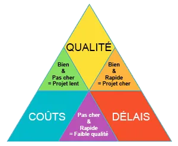

---
tags:
  - Management
  - Gestion_de_projet
  - GANTT
  - PERT
  - RACI
  - QCD
---

# Outils de la Gestion de Projet

La gestion de projet s'appuie sur plusieurs méthodologies et outils fondamentaux. Voici les quatre principaux outils utilisés pour planifier, répartir les rôles et équilibrer les contraintes.

---

## 1. Triangle QCD (Qualité, Coût, Délai)

Le triptyque QCD représente les trois contraintes majeures et indissociables de tout projet (le "triangle de fer"). Toute modification sur l'un de ces sommets aura un impact direct sur les autres.

  

* **Qualité + Coût (Bien & Pas cher)** = **Projet lent** (Délai non respecté).
* **Qualité + Délai (Bien & Rapide)** = **Projet cher** (Nécessite beaucoup de ressources).
* **Coût + Délai (Pas cher & Rapide)** = **Faible qualité** (Travail bâclé ou dette technique).

Le modèle QCD est un outil d'aide à la décision très puissant pour comparer des offres de prestataires, ou pour évaluer le succès d'un projet *post-mortem* (Le budget a-t-il été tenu ? Les délais ? Le taux de bugs est-il acceptable ?). On peut y ajouter d'autres indicateurs selon le domaine (ex: Sécurité pour l'IT).

---

## 2. Matrice RACI (Répartition des rôles)

La matrice RACI définit "Qui fait quoi" de manière non ambiguë au sein d'un projet ou processus.

| Lettre | Rôle | Description | Règle d'or |
| :--- | :--- | :--- | :--- |
| **R** | **Responsible** (Réalisateur) | La personne ou l'équipe qui exécute concrètement la tâche (le "faiseur"). | Au moins un "R" par tâche. |
| **A** | **Accountable** (Approbateur) | Le responsable final (détenteur de l'autorité, souvent le chef de projet/manager). C'est lui qui assume si la tâche échoue. | **UN SEUL "A" par tâche.** (S'il y a plusieurs chefs, personne ne décide). |
| **C** | **Consulted** (Consulté) | L'expert(e) à qui l'on demande conseil ou avis *avant* de prendre la décision ou de commencer. | Communication bidirectionnelle. |
| **I** | **Informed** (Informé) | Les personnes tenues au courant de l'avancement ou *après* la décision (pas d'impact direct sur la tâche). | Communication unidirectionnelle. |

---

## 3. Diagramme de GANTT (Planification temporelle)

Le GANTT est le tableau de bord visuel de l'avancement temporel.
* **En ordonnée (à gauche)** : La liste des tâches.
* **En abscisse (en haut)** : Le temps (Jours, Semaines).

**Avantages** : Met en évidence les dates de début/fin, les jalons (milestones), et surtout les **dépendances** (On ne peut pas commencer la tâche B tant que la tâche A n'est pas terminée).
**Outils** : MS Project, Jira, Asana, Monday.

---

## 4. Diagramme PERT (Ordonnancement logique)

Contrairement au GANTT qui est "lié au calendrier", le diagramme PERT (*Program Evaluation and Review Technique*) est axé sur la **logique d'enchaînement réseau**.
Il sert avant tout à visualiser le **Chemin Critique** (la suite de tâches incompressibles qui dicte la durée totale du projet. Si une tâche du chemin critique prend du retard, tout le projet prend du retard).

*(Le PERT et le GANTT sont extrêmement complémentaires en début de phase de planification).*
