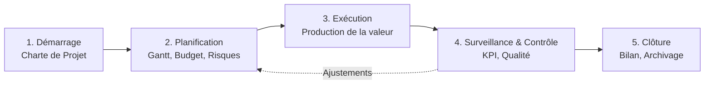

---
tags:
  - Management
  - Gestion_de_projet
  - Certifications
  - PMI
  - PMP
---

# PMI et Certification PMP

Le standard mondial américain de la gestion de projet et sa certification phare.

## 1. Définition
* **PMI (Project Management Institute)** : C'est la plus grande association professionnelle mondiale (à but non lucratif) dédiée à la gestion de projet, basée aux États-Unis.
* **PMP (Project Management Professional)** : C'est la certification suprême, mondialement reconnue et réputée très difficile à obtenir, délivrée par le PMI. Elle atteste qu'un professionnel possède l'expérience et maîtrise parfaitement l'art de diriger et structurer un projet complexe.

## 2. Description / Fonctionnement
Le PMI ne vend pas une méthodologie stricte étape par étape. Il édite et publie un énorme livre qui sert de bible à la profession : le **PMBOK (Project Management Body of Knowledge)**.
Le PMBOK est une encyclopédie (le recueil de connaissances) qui regroupe toutes les meilleures pratiques mondiales de gestion de projet. Il est organisé autour de grandes logiques :
1. **Les Groupes de Processus** : Démarrage, Planification, Exécution, Surveillance/Contrôle, Clôture.
2. **Les Domaines de Connaissances** : Gestion du Périmètre (Scope), des Délais, des Coûts, de la Qualité, des Ressources, des Communications, des Risques, des Achats, et des Parties Prenantes (Stakeholders).

La certification **PMP** exige plusieurs années d'expérience terrain justifiées avant même d'avoir le droit de se présenter à l'examen.

## 3. Utilisation / Cas Pratique
Les chefs de projet certifiés PMP utilisent le PMBOK comme une immense **boîte à outils**. 
Contrairement à la méthodologie *PRINCE2* qui impose un cadre de gouvernance très strict sur "comment faire le projet", le chef de projet PMP pioche intelligemment dans le PMBOK les outils dont il a besoin au moment où il en a besoin (ex: Il va chercher la technique du [PERT](outils_gestion_projet.md) pour calculer les délais, ou la [Matrice RAID](journal_raid.md) pour les risques).
Il est très courant dans les offres d'emploi des grandes multinationales (notamment américaines, les banques, l'industrie lourde) de voir la mention : *"Exigence : Certification PMP obligatoire"*.

## 4. Modifications possibles / Alternatives
Pendant très longtemps, le PMI et la certification PMP ont été perçus comme les champions de l'approche traditionnelle **Cycle en V (Prédictif ou Waterfall)**, jugée très lourde en documentation et avec une planification extrêmement rigide.
Face à la montée en puissance de l'innovation logicielle, la dernière version du PMBOK (Version 7) a totalement intégré les approches **Agiles** et **Hybrides**. Le chef de projet PMP moderne sait donc piocher dans des outils classiques (Gantt) ET dans des outils agiles (Sprints) selon les besoins du client.

* **L'Alternative européenne** : La certification **PRINCE2** (née au Royaume-Uni) est la grande concurrente du PMP en Europe. PRINCE2 dicte la gouvernance stricte (qui valide quoi, quand) plutôt que de donner des techniques mathématiques de gestion.

## 5. Exemples visuels et Liens utiles

### Les 5 grands groupes de processus du PMI

`Voir aussi : [Agilité et Scrum](agile_scrum.md) | [Outils de gestion de projet](outils_gestion_projet.md)`
