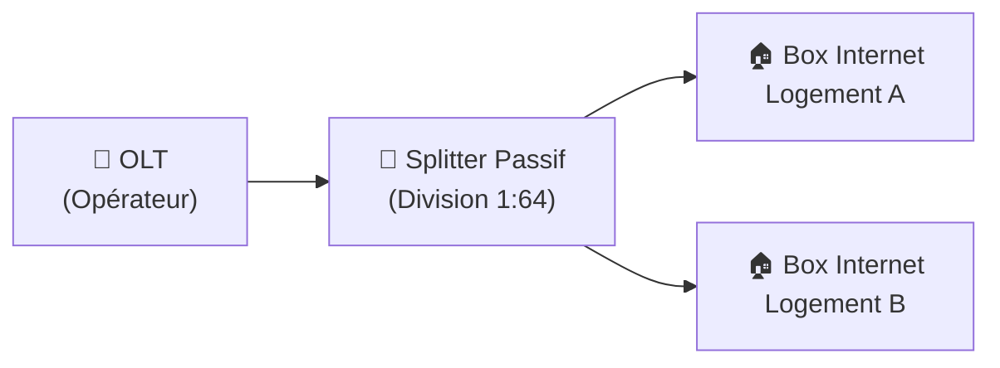

---
tags:
  - Reseau
  - Cablage
  - Fibre
  - RJ45
  - FTTH
---

# Câblage Réseau : Cuivre et Fibre Optique

Les supports physiques (Couche 1) permettant la transmission des données sur les réseaux.

## 1. Définition
Le câblage réseau constitue l'infrastructure physique fondamentale (Couche 1 du [modèle OSI](modele_osi.md)) d'un système d'information. Il se divise historiquement en deux grandes familles : le câblage **Cuivre** (paires torsadées RJ45) transmettant des impulsions électriques, et la **Fibre Optique** transmettant des impulsions lumineuses.

## 2. Description / Fonctionnement

**Le Cuivre (Câbles Ethernet RJ45)** :
Classé par "Catégories", il offre des débits croissants sur des distances courtes (limite stricte de 100 mètres avant dégradation du signal électrique).
* **Cat 5e** (1 Gbps) / **Cat 6** (10 Gbps limité sur 55m) / **Cat 6A** (10 Gbps garanti sur 100m).
* Il peut être non blindé (UTP) ou blindé contre les interférences magnétiques (FTP/STP).
* Avantage massif : il transporte de l'électricité en plus de la donnée via la norme **PoE (Power over Ethernet)** pour alimenter les équipements (de 15W à 90W).

**La Fibre Optique** :
* **Monomode (SMF)** : Cœur extrêmement fin, le faisceau laser voyage de manière rectiligne. Portée immense (jusqu'à 40km ou plus). Gaine visuelle souvent **jaune**.
* **Multimode (MMF)** : Cœur plus large, réflexion lumineuse multiple avec des LEDs. Portée courte à moyenne (jusqu'à 500m). Gaine visuelle souvent **orange ou aqua**.

## 3. Utilisation / Cas Pratique
* **Réseau Local (LAN intra-bureau)** : On câble les bureaux des employés et les caméras IP en cuivre RJ45 (Cat 6A) pour bénéficier de l'alimentation PoE.
* **Réseau de Campus** : On relie les baies de brassage des différents bâtiments d'un hôpital ou d'une université entre elles via de la Fibre Multimode (liaisons montantes ou "Uplinks").
* **Datacenter** : On utilise massivement des cordons Fibre Optique à très haute densité (Connecteurs MPO multi-fibres) pour atteindre du 40 Gbps ou 100 Gbps entre les serveurs et les switchs Core.

## 4. Modifications possibles / Alternatives
**FTTH (Fiber To The Home)** : Variante d'architecture optique (PON - Passive Optical Network) avec des répartiteurs passifs en verre ("Splitters") permettant de diviser le signal d'une seule fibre opérateur pour distribuer Internet à 64 abonnés à moindre coût (comparé à une fibre point-à-point dédiée).

**Fibre Noire (Dark Fiber)** : Câble fibre nu loué par un opérateur sous l'espace public. L'entreprise locataire doit acheter et gérer ses propres équipements lasers à chaque extrémité. Offre une confidentialité totale et une bande passante virtuellement illimitée pour relier deux sites distants.

## 5. Exemples visuels et Liens utiles

### Architecture FTTH (Réseau Optique Passif)

