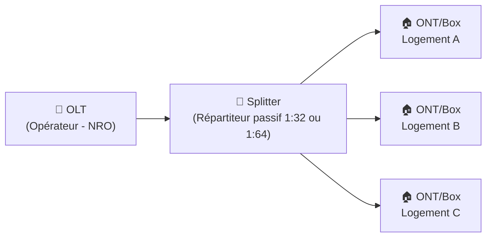

---
tags:
  - Reseau
  - Cablage
  - Fibre
  - RJ45
  - FTTH
---

# Câblage Réseau : RJ45, Fibre et FTTH

## Câblage Cuivre — RJ45 / Ethernet

Le câblage cuivre (**paires torsadées**) avec connecteur **RJ45** est le standard des réseaux locaux (LAN). Il existe plusieurs **catégories (Cat)** offrant des performances croissantes :

| Catégorie | Débit max | Fréquence | Portée max | Usage |
| :---: | :---: | :---: | :---: | :--- |
| **Cat 5e** | 1 Gbps | 100 MHz | 100m | Réseau entreprise standard |
| **Cat 6** | 10 Gbps | 250 MHz | 55m (10G) / 100m (1G) | Bureaux, serveurs |
| **Cat 6A** | 10 Gbps | 500 MHz | 100m | Datacenters, PoE++ |
| **Cat 7** | 10 Gbps | 600 MHz | 100m | Très blindé, usage professionnel |
| **Cat 8** | 25-40 Gbps | 2000 MHz | 30m | Baies de datacenter |

### Blindage (UTP / FTP / STP)

| Notation | Description |
| :---: | :--- |
| **UTP** | Unshielded Twisted Pair — Non blindé, usage courant bureau |
| **FTP** | Foiled Twisted Pair — Blindage global par feuille aluminium |
| **STP** | Shielded Twisted Pair — Chaque paire blindée individuellement |
| **S/FTP** | Double blindage (par paire + global) |

> Recommander le **F/UTP ou S/FTP** dans les environnements industriels ou avec beaucoup d'interférences électromagnétiques.

### PoE — Power over Ethernet

Le **PoE** permet d'alimenter des équipements (téléphones IP, caméras, points d'accès Wi-Fi) **via le câble Ethernet**, sans alimentation externe dédiée.

| Standard | Puissance max | Usage typique |
| :---: | :---: | :--- |
| **PoE (802.3af)** | 15,4W | Téléphones IP, petites caméras |
| **PoE+ (802.3at)** | 30W | Points d'accès Wi-Fi, caméras PTZ |
| **PoE++ (802.3bt)** | 60-90W | Écrans, PC tout-en-un |

---

## Fibre Optique

La fibre optique transmet les données sous forme de **lumière** dans un fil de verre ou de plastique. Elle offre des débits bien supérieurs au cuivre sur de longues distances, sans dégradation du signal et immunisée aux interférences électromagnétiques.

### Fibre Monomode (SMF — Single Mode Fiber)

| Caractéristique | Valeur |
| :--- | :--- |
| Cœur | Très fin (~9 µm) |
| Longueur d'onde | 1310nm / 1550nm |
| Portée | **Jusqu'à 40km et plus** |
| Débit | Très élevé |
| Coût | Plus élevé (laser précis) |
| Couleur gaine standard | **Jaune** |
| Usage | Longues distances, dorsales métropolitaines, liens inter-sites |

### Fibre Multimode (MMF — Multi Mode Fiber)

| Caractéristique | Valeur |
| :--- | :--- |
| Cœur | Plus large (50 ou 62.5 µm) |
| Longueur d'onde | 850nm / 1300nm |
| Portée | **Jusqu'à ~550m (OM4)** |
| Débit | Élevé sur courte distance |
| Coût | Moins cher (LED / VCSEL) |
| Couleur gaine standard | **Orange** (OM1/OM2) / **Aqua** (OM3/OM4) / **Violet** (OM5) |
| Usage | Intra-datacenter, campus, distances courtes |

### Connecteurs fibre courants

| Connecteur | Forme | Usage |
| :---: | :--- | :--- |
| **LC** | Petit, carré | Standard datacenter, SFP |
| **SC** | Plus grand, carré | Équipements télécoms, FTTx |
| **ST** | Rond, à baïonnette | Ancien, militaire |
| **MPO/MTP** | Multi-fibres (12/24) | Très hauts débits datacenter |

---

## Fibre Noire (Dark Fiber)

La **fibre noire** est une infrastructure fibre optique déjà installée mais **non éclairée** (sans équipement actif aux extrémités). Elle est louée ou achetée par des opérateurs ou des entreprises qui y connectent leurs propres équipements actifs (DWDM, amplificateurs, switches...).

**Avantages :**
* Contrôle total sur les équipements et les protocoles utilisés
* Bande passante potentiellement illimitée (on choisit ses propres transpondeurs)
* Confidentialité totale du trafic (pas d'opérateur intermédiaire sur le plan actif)

**Inconvénients :**
* Coût d'investissement élevé (équipements actifs à charge du client)
* Maintenance complexe
* Utilisé principalement par les **grandes entreprises, OIV, opérateurs et opérateurs publics locaux**

---

## FTTH — Fiber To The Home

Le **FTTH** (Fiber To The Home) est le déploiement de la fibre optique **jusqu'au logement ou au local professionnel**. C'est la technologie qui remplace progressivement l'ADSL/VDSL en France dans le cadre du **Plan France Très Haut Débit**.

### Architecture FTTH (PON — Passive Optical Network)

| Composant | Rôle |
| :--- | :--- |
| **OLT** (Optical Line Terminal) | Équipement actif chez l'opérateur (NRO — Nœud de Raccordement Optique) |
| **Splitter** | Répartiteur **passif** qui divise le signal optique vers plusieurs logements |
| **ONT** (Optical Network Terminal) | Modem/box optique chez l'abonné |

**Débits FTTH :** Selon l'offre et la technologie (GPON / XGS-PON) : de **100 Mbps symétrique** à **10 Gbps**.

### Variantes FTTx

| Acronyme | Signification | Portée fibre |
| :---: | :--- | :--- |
| **FTTH** | Fiber To The Home | Jusqu'au logement |
| **FTTB** | Fiber To The Building | Jusqu'au pied de l'immeuble |
| **FTTC** | Fiber To The Curb/Cabinet | Jusqu'à l'armoire de rue |
| **FTTO** | Fiber To The Office | Fibre dédiée pour entreprises (SLA garanti) |
