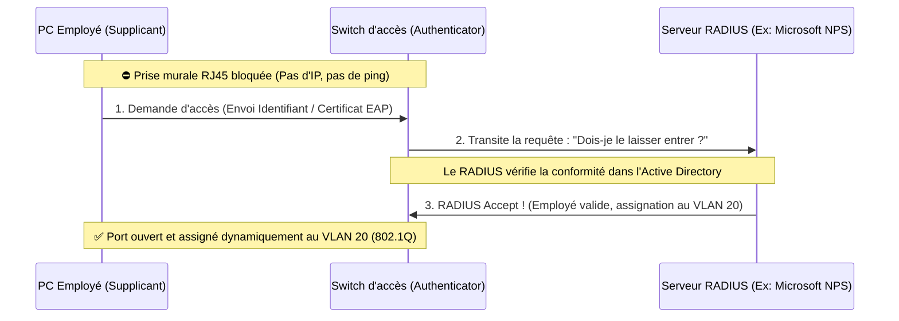

---
tags:
  - Reseau
  - Securite
  - Trames
  - 802.1Q
  - 802.1X
---

# Trames taguées : 802.1Q et 802.1X

Les mécanismes de modification des trames pour le routage des VLANs et la sécurité d'accès.

## 1. Définition
Dans les réseaux d'entreprise modernes, la [trame Ethernet (802.3)](ethernet_trames.md) classique, simple boîte de livraison, est souvent modifiée à la volée par les switchs pour y insérer des informations supplémentaires (des *Tags*). 
Les deux standards majeurs de modification et de contrôle de ces trames sont la norme **802.1Q** (Taggage pour la gestion des VLANs) et la norme **802.1X** (Contrôle d'accès physique de sécurité au réseau).

## 2. Description / Fonctionnement

**Le Tag 802.1Q (Gestion des VLANs)**
Il ajoute 4 octets à l'en-tête de la trame Ethernet. Le champ le plus important est le **VID (VLAN ID sur 12 bits)** qui précise explicitement à quel réseau virtuel appartient cette trame.
Sur un câble *Trunk* (reliant deux switchs), un switch insère ce tag quand la trame sort, et le switch d'en face lit le tag pour redistribuer la trame au bon département de l'entreprise (ex: VLAN Compta).

**Le Standard 802.1X / PNAC (Sécurité)**
C'est un mécanisme drastique qui **bloque physiquement l'accès au réseau** au niveau du port RJ45 ou de la borne Wi-Fi, tant que l'appareil (le PC de l'employé) ne s'est pas authentifié.
Tant que l'authentification n'a pas réussi, le port du switch ne laisse passer **strictement que** le trafic d'authentification cryptographique (Protocole EAP). Absolument tout autre trafic (Requêtes DHCP, Ping, Web) est bloqué.

## 3. Utilisation / Cas Pratique
**Utilisation de 802.1X** : Dans le hall d'un bâtiment d'entreprise, les prises RJ45 murales sont sécurisées. Si un visiteur inconnu branche son PC portable personnel, le réseau lui est bloqué par le switch (norme 802.1X). 
Si un vrai employé se branche, son PC envoie automatiquement (ex: EAP-TLS) son certificat numérique d'entreprise invisible. Le switch interroge le serveur de sécurité central (Serveur RADIUS/NPS) qui valide le droit d'accès.
Mieux encore, le serveur RADIUS peut dire au switch de manière intelligente : "Cet employé fait partie des Ressources Humaines, ouvre le port et mets-le dynamiquement dans le VLAN 30 (802.1Q)".

## 4. Modifications possibles / Alternatives
**L'alternative MAB (MAC Authentication Bypass)** : 
Le protocole 802.1X est complexe à gérer pour les "vieux" appareils dits "bêtes" (Imprimantes, Caméras de sécurité, Sondes IoT) car ils n'ont pas d'interface pour taper un mot de passe ou charger un certificat. Pour eux, l'administrateur active l'alternative **MAB**. Le switch lit naïvement l'adresse MAC (numéro matériel) de l'imprimante et l'envoie au serveur RADIUS. Si la MAC est dans la base de données autorisée, le port s'ouvre. Ce n'est malheureusement pas très sécurisé (une adresse MAC se falsifie très facilement par *Spoofing*).

## 5. Exemples visuels et Liens utiles

### Architecture de sécurité 802.1X Entreprise

### Composition du Tag 802.1Q dans la trame
Le switch l'insère chirurgicalement au milieu de la trame :
`MAC Destination` | `MAC Source` | **TAG 802.1Q (4 Octets insérés)** | `Ethertype (Taille)` | `Données Applicatives (Payload IP)`
