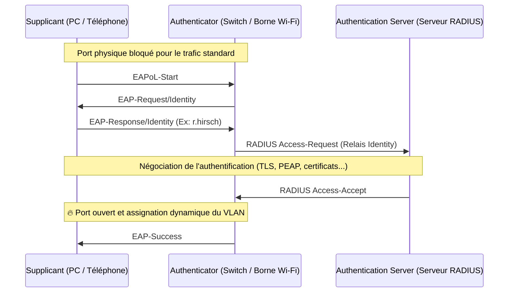

---
tags:
  - Reseau
  - Securite
  - Trames
  - 802.1Q
  - 802.1X
---

# Trames taguées : 802.1Q et 802.1X

Dans les réseaux d'entreprise modernes, une [trame Ethernet classique (802.3)](Protocoles/ethernet_trames.md) est souvent modifiée pour y insérer des informations supplémentaires (*tags*). Les deux usages les plus fondamentaux sont le taggage VLAN (802.1Q) et le contrôle d'accès réseau (802.1X).

## 1. Trames 802.1Q (Taggage VLAN)

Le standard **IEEE 802.1Q** définit la manière d'insérer un tag VLAN dans l'en-tête d'une trame Ethernet. C'est ce qui permet de faire passer le trafic de plusieurs VLANs simultanément sur un seul câble physique ([liaison Trunk](vlan.md)).

### Composition du Tag 802.1Q (4 octets)

Le tag 802.1Q est inséré **juste après les adresses MAC source/destination**, et avant le champ Type/Longueur. Il ajoute 4 octets à la trame Ethernet classique (qui passe de 1518 à 1522 octets max).

```text
+-----------+-----------+---------+-----------+-----------+---------+
| MAC Dest. | MAC Src.  | 802.1Q  | Éthertype |   Data    |   FCS   |
| (6 octets)| (6 octets)|(4 octets)| (2 octets)| (46-1500) |(4 octets)|
+-----------+-----------+---------+-----------+-----------+---------+
```

Le tag lui-même se décompose ainsi :
1. **TPID (Tag Protocol Identifier)** (2 octets) : Fixé à `0x8100` pour indiquer qu'il s'agit d'une trame taguée 802.1Q.
2. **PCP (Priority Code Point) / 802.1p** (3 bits) : Définit la [QoS (Qualité de Service)](#qos-8021p). Valeur de 0 à 7 (voix sur IP, vidéo...).
3. **DEI (Drop Eligible Indicator)** (1 bit) : Indique si la trame peut être jetée en priorité en cas de congestion.
4. **VID (VLAN Identifier)** (12 bits) : Le numéro du VLAN. Sur 12 bits, on peut avoir jusqu'à $2^{12} = 4096$ VLANs virtuels (les numéros 0 et 4095 sont réservés).

### VLAN Natif (Untagged)

Sur un port Trunk 802.1Q, un VLAN spécifique (généralement le VLAN 1, bien que ce soit déconseillé pour des raisons de sécurité) est désigné comme **VLAN natif**. Les trames appartenant au VLAN natif **ne reçoivent pas de tag 802.1Q**. Si le switch reçoit une trame standard (sans tag) sur un port Trunk, il l'assigne automatiquement au VLAN natif.

---

## 2. IEEE 802.1X (Contrôle d'accès basé sur les ports)

Le standard **IEEE 802.1X / PNAC** (Port-Based Network Access Control) est un mécanisme de sécurité qui **bloque l'accès au réseau au niveau du port physique** tant que l'équipement ne s'est pas authentifié. C'est la norme utilisée pour sécuriser les réseaux Wi-Fi (WPA2/3-Enterprise) et les prises RJ45 dans les entreprises.

### Principe de fonctionnement

Tant que l'authentification n'a pas réussi, le port du switch ne laisse passer **que le trafic d'authentification (EAPoL - EAP over LAN)**. Tout autre trafic (DHCP, IP...) est bloqué.



### Cas concrets d'utilisation

1. **Wi-Fi WPA2/WPA3-Enterprise** : Chaque employé se connecte avec ses identifiants Active Directory plutôt qu'avec une clé WPA partagée.
2. **Assignation dynamique de VLANs** : En fonction du compte qui s'authentifie, le serveur RADIUS (souvent *Microsoft NPS* ou *Cisco ISE*) indique au switch dans quel VLAN placer le port (ex: le port bascule en VLAN 10 si la personne authentifiée est de la compta, en VLAN 50 si c'est un administrateur).
3. **MAB (MAC Authentication Bypass)** : Utilisé pour les équipements sans interface utilisateur (imprimantes anciennes, IoT, caméras) qui ne gèrent pas le protocole 802.1X. Le switch utilise leur adresse MAC comme identifiant auprès du serveur RADIUS.

### Les différentes méthodes EAP (Extensible Authentication Protocol)

802.1X s'appuie sur la famille des protocoles **EAP**. Les plus communs :
* **EAP-TLS** : Méthode la plus sécurisée. Utilise des **certificats numériques** sur le client ET sur le serveur. Ne nécessite pas de mot de passe.
* **PEAP (Protected EAP)** : Utilise un certificat uniquement sur le serveur (pour monter un tunnel sécurisé TLS), puis l'authentification du client passe par identifiant/mot de passe (ex: MS-CHAPv2). Très utilisé dans les architectures Windows AD.
