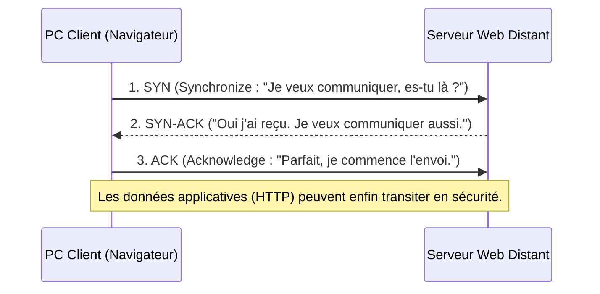

---
tags:
  - Reseau
  - Protocoles
  - TCP
  - IP
---

# TCP/IP

L'architecture de communication fondamentale, socle des échanges sur Internet.

## 1. Définition
La **suite des protocoles TCP/IP** (Transmission Control Protocol / Internet Protocol) est le modèle de communication réseau standard d'Internet et de l'écrasante majorité des réseaux locaux modernes. Contrairement au [modèle OSI](modele_osi.md) qui est purement théorique (7 couches), TCP/IP est l'implémentation pratique concrète et opérationnelle, structurée en 4 couches.

## 2. Description / Fonctionnement
L'architecture TCP/IP repose sur la collaboration étroite de deux grands protocoles "piliers" :
* **L'IP (Internet Protocol)** (Couche Réseau) : S'occupe de l'adressage des machines (IPv4/IPv6) et du routage mathématique sur le globe. L'IP livre les paquets (comme un facteur) au bon destinataire, mais il ne garantit absolument pas qu'ils arriveront intacts (*protocole "Best-Effort"*).
* **Le TCP (Transmission Control Protocol)** (Couche Transport) : S'occupe de la fiabilité que l'IP ne possède pas. Il établit une session sécurisée au préalable (*Three-way handshake*), fragmente les données dans le bon ordre, vérifie l'intégrité logicielle à l'arrivée et force automatiquement la retransmission des paquets s'ils ont été perdus en cours de route. C'est "l'accusé de réception" du réseau.

## 3. Utilisation / Cas Pratique
Lorsqu'un utilisateur ouvre un site Web bancaire (HTTPS), son navigateur utilise le protocole d'Application HTTP. Ce dernier a un besoin vital de fiabilité : une page web incomplète est illisible. Il s'appuie donc sur la connexion **TCP** (sur le Port 443) pour garantir qu'aucun morceau ne manque, qui elle-même s'appuie sur le protocole **IP** pour être acheminée d'un continent à l'autre par les routeurs des opérateurs télécoms jusqu'au serveur de la banque.

## 4. Modifications possibles / Alternatives
**L'alternative majeure au TCP est le protocole UDP (User Datagram Protocol)**.
L'UDP fonctionne au même niveau que le TCP (Couche Transport), mais il ne demande **aucun accusé de réception** et n'établit pas de session. Il "tire" ses paquets en continu le plus vite possible.
* **Quand utilise-t-on le TCP ?** Web, E-mails, Transfert de fichiers FTP (quand la perte d'un seul octet corrompt irrémédiablement le fichier).
* **Quand utilise-t-on l'UDP ?** Téléphonie VoIP, Visioconférence Teams/Zoom, Jeux vidéo multi-joueurs, IPTV (situations de flux temps réel où la rapidité brute prime : il vaut mieux perdre une image qui causera un pixel figé d'une milliseconde, plutôt que d'attendre qu'elle soit retransmise, causant un décalage audio/vidéo insupportable).

## 5. Exemples visuels et Liens utiles

### Comparaison des Modèles (OSI vs TCP/IP)
| Modèle OSI (Théorique 7 couches) | Modèle TCP/IP (Pratique 4 couches) | Exemples de Protocoles |
| :--- | :--- | :--- |
| Application, Présentation, Session | **Application** | HTTP, DNS, FTP, SMTP |
| Transport | **Transport** | TCP, UDP |
| Réseau | **Internet** | IPv4, IPv6, ICMP |
| Liaison de données, Physique | **Accès Réseau** | Ethernet, Wi-Fi, Fibre |

### L'Établissement de session TCP ("Three-way Handshake")
Avant d'envoyer la moindre donnée de son fichier, le protocole TCP s'assure poliement que l'hôte distant est vivant et prêt à l'écouter.

