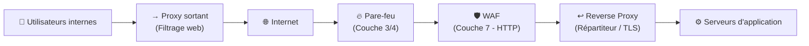

---
tags:
  - Reseau
  - Securite
  - Firewall
  - Proxy
  - WAF
---

# Proxy, Reverse Proxy, WAF et Pare-feu

Ces quatre composants forment les couches de **filtrage et de protection** entre Internet et votre infrastructure. Bien que souvent confondus, ils ont des rôles distincts et complémentaires.

## Vue d'ensemble des couches



---

## Pare-feu (Firewall)

Le pare-feu est la **première ligne de défense**. Il filtre le trafic réseau en se basant sur des **règles** (IP source/destination, port, protocole).

### Types de pare-feu

| Type | Couche OSI | Fonctionnement |
| :--- | :---: | :--- |
| **Filtrage de paquets** | 3/4 | Inspecte IP, port, protocole de chaque paquet. Stateless. |
| **Stateful (SPI)** | 3/4 | Suit l'état des connexions TCP ; connaît le contexte. Standard actuel. |
| **Applicatif (NGFW)** | 7 | Inspecte le contenu applicatif (DPI), identification des apps (Skype, Teams...), prévention d'intrusion (IPS). |

### Règles de pare-feu

Les règles sont lues **de haut en bas** et la première règle qui correspond est appliquée. Il est impératif de terminer par une règle **"DENY ALL"** implicite ou explicite.

```
Exemple de règle :
[Numéro] [Action] [Source IP] [Dest IP] [Port] [Protocole] [Log]
  1       PERMIT   10.0.1.0/24  10.0.2.10  443    TCP        YES   → Autorise HTTPS vers le serveur web
  2       PERMIT   10.0.0.0/8   8.8.8.8    53     UDP        NO    → Autorise DNS vers Google
  3       DENY     ANY          ANY        ANY    ANY        YES   → Bloque tout le reste (deny all)
```

> [!IMPORTANT]
> **Principe du moindre privilège** : n'autoriser que ce qui est strictement nécessaire. Partir d'un DENY ALL et ouvrir au fur et à mesure.

### Règles sens entrant (Inbound) vs sortant (Outbound)

| Sens | Direction | Exemple |
| :--- | :--- | :--- |
| **Inbound** | Internet → LAN | Autoriser HTTP/HTTPS entrant vers le serveur web |
| **Outbound** | LAN → Internet | Autoriser les mises à jour Windows vers internet |

---

## Proxy (Proxy Sortant / Forward Proxy)

Le **proxy sortant** est un intermédiaire entre les **utilisateurs internes** et Internet. Les requêtes web des postes clients passent par le proxy avant d'atteindre Internet.

**Fonctions :**
* **Filtrage de contenu** : Blocage des sites interdits (jeux, réseaux sociaux...) par catégorie ou liste noire.
* **Mise en cache** : Stocke localement les contenus fréquemment visités pour économiser la bande passante.
* **Authentification** : Force les utilisateurs à s'authentifier avant de naviguer.
* **Journalisation** : Trace toutes les URLs visitées (obligation légale pour certaines organisations).
* **SSL Inspection (MITM)** : Déchiffre le trafic HTTPS pour l'analyser.

> **Outils courants** : Squid (open-source), Zscaler Internet Access (cloud), Blue Coat/Symantec, Microsoft Entra Internet Access.

---

## Reverse Proxy

Le **reverse proxy** est l'inverse : il est entre Internet et les **serveurs internes**. Les clients extérieurs croient parler directement au serveur final, mais c'est le reverse proxy qui répond à leur place.

**Fonctions :**
* **Terminaison TLS (SSL Offloading)** : Gère les certificats HTTPS à la place des serveurs backend.
* **Répartition de charge (Load Balancing)** : Distribue les requêtes entre plusieurs serveurs pour la performance et la HA.
* **Mise en cache** : Cache les ressources statiques.
* **Masquage de l'infrastructure** : Le client ne connaît jamais les IPs réelles des serveurs internes.

> **Outils courants** : Nginx, HAProxy, Apache HTTP Server, Traefik, Caddy, F5 BIG-IP.

---

## WAF (Web Application Firewall)

Le **WAF** opère au niveau applicatif (**couche 7 / HTTP**). Contrairement au pare-feu réseau qui filtre sur les IPs et ports, le WAF analyse le **contenu des requêtes HTTP/HTTPS** pour bloquer les attaques web.

**Ce qu'il bloque :**
* **Injection SQL** : `GET /page?id=1' OR '1'='1`
* **XSS** (Cross-Site Scripting) : Injection de scripts malveillants dans des pages web
* **CSRF** (Cross-Site Request Forgery)
* **Path Traversal** : `../../etc/passwd`
* Attaques référencées dans l'**OWASP Top 10**

> **Outils courants** : ModSecurity (open-source), AWS WAF, Cloudflare WAF, F5 Advanced WAF, Fortinet FortiWeb.
