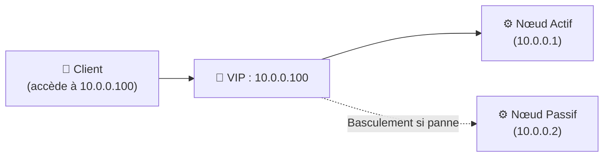
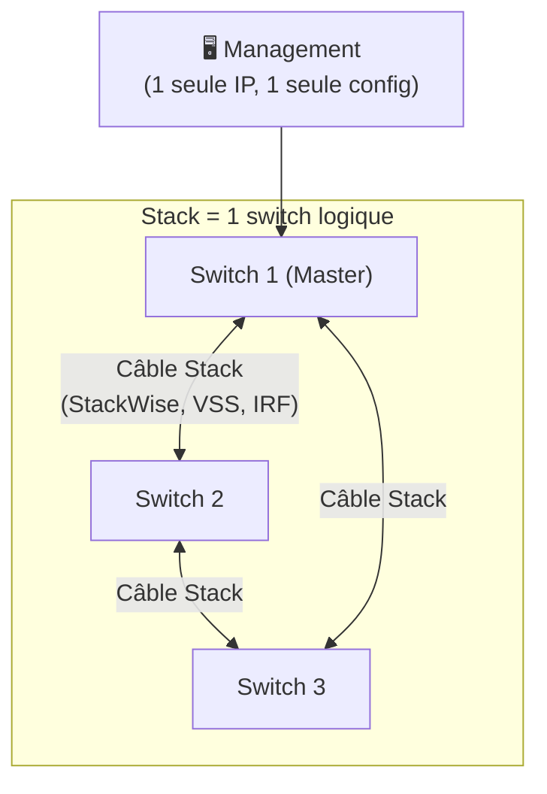

---
tags:
  - Reseau
  - Systeme
  - Haute Disponibilité
  - Cluster
  - HA
---

# VIP, Cluster, HA et Stack

Ces concepts désignent les différentes techniques utilisées pour **garantir la disponibilité et la redondance** d'un service ou d'un équipement réseau.

## VIP — Virtual IP Address

Une **VIP** (Adresse IP Virtuelle) est une adresse IP qui n'est pas liée à un seul équipement physique, mais qui **flotte** entre plusieurs serveurs ou équipements. Les clients accèdent toujours à la même IP, qui est prise en charge par l'équipement actif à un instant donné.

**Protocoles de gestion de VIP :**
* **VRRP** (Virtual Router Redundancy Protocol) : Standard ouvert, très utilisé sur les routeurs et pare-feux. Un routeur **Master** détient la VIP, les autres sont en **Backup**.
* **HSRP** (Hot Standby Router Protocol) : Protocole propriétaire Cisco, logique similaire à VRRP.
* **CARP** (Common Address Redundancy Protocol) : Utilisé sur BSD et pfSense.
* **Keepalived** : Solution Linux très répandue pour la gestion de VIP couplée à des health checks.

---

## Cluster

Un **cluster** est un groupe de serveurs qui travaillent ensemble pour former un **système unique et plus fiable** (ou plus puissant). Il existe deux grandes familles :

### Cluster de Haute Disponibilité (HA Cluster)

Objectif : **Éliminer les points uniques de défaillance (SPOF)**. Si un nœud tombe, un autre prend le relais automatiquement.

| Mode | Description |
| :--- | :--- |
| **Actif / Passif** | Un seul nœud traite les requêtes, l'autre attend en veille. |
| **Actif / Actif** | Tous les nœuds traitent des requêtes simultanément. Répartition de charge + redondance. |

### Cluster de Load Balancing

Plusieurs serveurs traitent les requêtes en parallèle pour améliorer les **performances et la scalabilité**. Un **load balancer** (matériel ou logiciel) distribue les requêtes selon différents algorithmes :

| Algorithme | Fonctionnement |
| :--- | :--- |
| **Round Robin** | Envoie à chaque serveur à tour de rôle |
| **Least Connections** | Envoie au serveur qui a le moins de connexions actives |
| **IP Hash** | Le même client va toujours sur le même serveur (session persistante) |
| **Weighted** | Servers plus puissants reçoivent plus de requêtes |

---

## HA — High Availability (Haute Disponibilité)

La **HA** est un objectif de conception : garantir qu'un service reste **disponible un maximum de temps**, exprimé en pourcentage d'uptime :

| Niveau | % Disponibilité | Indisponibilité max / an |
| :---: | :---: | :--- |
| **3 nines** | 99,9% | ~8h 45min |
| **4 nines** | 99,99% | ~52 min |
| **5 nines** | 99,999% | ~5 min |

### Composants d'une architecture HA

* **Redondance matérielle** : Alimentations doubles, disques en RAID, cartes réseau en agrégation (LACP/bonding)
* **Clustering** : Plusieurs nœuds capables de prendre le relais
* **VIP / Floating IP** : Les clients ne changent pas d'adresse lors d'un basculement
* **Health checks** : Surveillance continue de l'état des nœuds
* **Fencing / STONITH** : Mécanisme d'isolation d'un nœud défaillant pour éviter le split-brain

> [!IMPORTANT]
> Le **Split-Brain** est la situation où deux nœuds d'un cluster pensent chacun être le seul actif (après une perte de la liaison inter-nœuds). Cela peut provoquer une corruption des données. Le mécanisme **STONITH** (Shoot The Other Node In The Head) éteint de force le nœud incertain.

---

## Stack (Empilage de switches)

Une **stack** est un groupe de switches interconnectés par un câble dédié (backplane virtuel) et qui fonctionnent comme **un seul équipement logique** géré depuis une seule interface.

**Avantages :**
* **Gestion simplifiée** : Une seule IP de management, une seule configuration, un seul fichier IOS.
* **Redondance** : Si le switch Master tombe, un autre prend le rôle automatiquement.
* **Haute bande passante inter-switches** : Le backplane de stack est bien plus rapide qu'un simple câble réseau.
* **Ports agrégés (LAG) cross-stack** : On peut créer un agrégat de liens physiquement répartis sur différents switches de la stack.

**Technologies propriétaires :**
* **Cisco StackWise / StackWise Virtual** (VSS pour les Catalyst 6500+)
* **HP/Aruba IRF** (Intelligent Resilient Framework)
* **Juniper Virtual Chassis**
