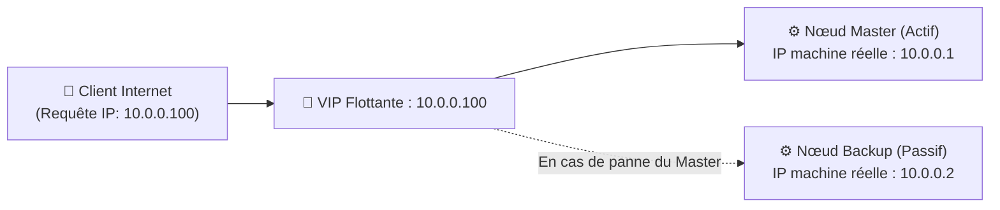
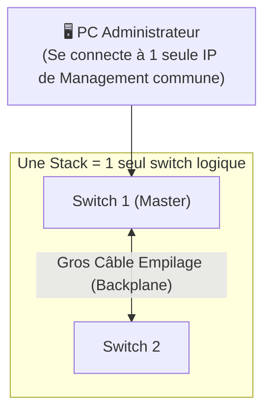

---
tags:
  - Reseau
  - Systeme
  - Haute Disponibilité
  - Cluster
  - HA
---

# VIP, Cluster, HA et Stack

Les concepts clés pour garantir la résilience extrême et la continuité de service des infrastructures.

## 1. Définition
La **Haute Disponibilité (HA - High Availability)** est un objectif majeur de conception d'architecture visant à éliminer totalement les points uniques de défaillance (SPOF - Single Point of Failure). Le but est de garantir qu'un service informatique reste accessible et transparent pour les utilisateurs, même en cas de panne matérielle sévère (feu, perte de courant, crash matériel).

## 2. Description / Fonctionnement
Pour atteindre la HA, l'infrastructure s'appuie sur plusieurs technologies collaboratives :
* **Le Cluster** : C'est un groupe de serveurs physiques qui travaillent main dans la main. S'il s'agit d'un cluster *Actif/Passif*, un seul serveur travaille, l'autre est en veille de secours. S'il est *Actif/Actif* (Load Balancing / Équilibrage de charge), ils se partagent le travail en permanence. Si l'un meurt, les survivants encaissent la totalité de son trafic.
* **La VIP (Virtual IP)** : C'est une adresse IP "flottante" qui n'est pas fixée physiquement. Si le serveur A (qui détient la VIP) tombe en panne, le serveur B réclame immédiatement la VIP. Le client distant, qui ne connaît que l'adresse de cette VIP, ne subit aucune coupure.
* **La Stack (Empilage)** : Technologie spécifique aux switchs réseau physiques. On relie plusieurs switchs empilés par un très gros câble dédié à l'arrière pour qu'ils fusionnent et ne forment plus qu'un seul gros équipement logique aux yeux de l'administrateur.

## 3. Utilisation / Cas Pratique
Lors du déploiement d'un portail web e-commerce ultra-critique, on place un *Load Balancer* (équilibreur de charge type HAProxy) devant deux gros serveurs Web. Le Load Balancer détient la **VIP** publique connue des clients. Il répartit le trafic de manière équitable (*Cluster Actif/Actif*).
Côté armoire réseau, ces serveurs sont branchés à une **Stack** de 2 switchs en lien agrégé (LACP - un câble vers chaque switch). Ainsi, si un câble est coupé, qu'un switch grille, ou qu'un serveur Web brûle, le site web ne s'arrête pas une seule seconde.

## 4. Modifications possibles / Alternatives
L'ennemi mortel redouté de tout cluster est le fameux phénomène de **Split-Brain**. 
C'est le cas très grave où le lien réseau de synchronisation entre le nœud A et le nœud B est coupé, mais que les deux serveurs physiques sont encore en vie de leur côté. Chacun croyant à tort que l'autre est mort, ils s'arrogent tous les deux la VIP en même temps et écrivent sur les mêmes disques de stockage partagés simultanément, ce qui entraîne une corruption irréversible de la base de données.
La parade technologique est le **STONITH (Shoot The Other Node In The Head)** : Un mécanisme bas-niveau (ex: via iDRAC/IPMI) qui donne l'ordre d'éteindre de force l'alimentation électrique de l'autre nœud au moindre doute.

## 5. Exemples visuels et Liens utiles

### Basculement via VIP (Failover Actif/Passif)

### Stack de Switchs Réseau

