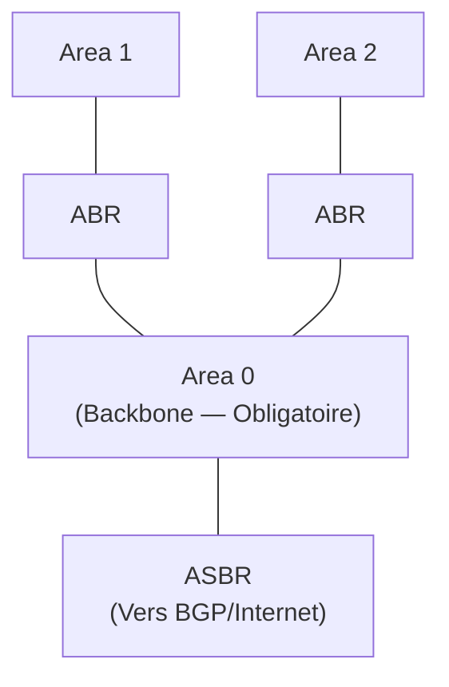

---
tags:
  - Reseau
  - Routage
  - OSPF
  - RIP
---

# Protocoles de Routage Dynamique

Les protocoles de routage dynamique permettent aux routeurs d'**échanger automatiquement leurs tables de routage** et de s'adapter aux changements de topologie réseau (pannes, ajout de liens...). Voir la page [Routage](routage.md) pour le fonctionnement général.

## Concepts communs

### Métrique
La **métrique** est la valeur qu'un protocole de routage utilise pour choisir le **meilleur chemin** vers une destination. Si plusieurs routes existent, celle avec la métrique la plus **faible** est préférée.

### Distance administrative (AD)
Quand plusieurs protocoles coexistent, le routeur utilise la **distance administrative** pour décider quel protocole il doit croire :

| Source de la route | Distance Administrative |
| :--- | :---: |
| Interface directement connectée | 0 |
| Route statique | 1 |
| EIGRP (résumé) | 5 |
| OSPF | **110** |
| RIP | **120** |
| EIGRP (externe) | 170 |
| Route inconnue | 255 (inutilisable) |

---

## RIP — Routing Information Protocol

RIP est l'un des **plus anciens** protocoles de routage. Il fonctionne selon l'algorithme **Bellman-Ford** (Distance Vector) : chaque routeur n'a de visibilité que sur ses voisins directs et partage sa table de routage entière.

### Caractéristiques

| Caractéristique | RIPv1 | RIPv2 |
| :--- | :---: | :---: |
| Classless (VLSM/CIDR) | ❌ Non | ✅ Oui |
| Authentification | ❌ Non | ✅ Oui (MD5) |
| Multicast | ❌ Broadcast | ✅ 224.0.0.9 |
| Métrique | Nombre de sauts | Nombre de sauts |
| Limite de sauts | **15 max** | **15 max** |
| Convergence | Lente | Lente |

> [!WARNING]
> RIP est **obsolète** pour les réseaux d'entreprise modernes. Sa limite de 15 sauts et sa convergence lente le rendent inadapté. Utiliser OSPF à la place.

### Mécanismes anti-boucle RIP
* **Split Horizon** : Ne pas réannoncer une route vers l'interface par laquelle on l'a apprise.
* **Route Poisoning** : Annoncer une route tombée avec la métrique infinie (16).
* **Holddown Timer** : Ignorer les mises à jour sur une route pendant un délai après sa perte.

### Configuration Cisco RIPv2

```bash
router rip
 version 2
 no auto-summary           ! Désactive la summarisation automatique (pour VLSM)
 network 192.168.1.0
 network 10.0.0.0
```

---

## OSPF — Open Shortest Path First

OSPF est le **protocole de routage Link-State** de référence pour les réseaux d'entreprise. Chaque routeur construit une **carte complète de la topologie** (LSDB — Link State Database) et calcule les meilleures routes avec l'algorithme **Dijkstra (SPF)**.

### Caractéristiques

| Caractéristique | Valeur |
| :--- | :--- |
| Type | Link-State |
| Métrique | **Coût** (basé sur la bande passante : 100 Mbps / BW) |
| Convergence | **Rapide** |
| Classless | ✅ Oui (VLSM, CIDR) |
| Authentification | ✅ Oui (MD5 / SHA) |
| Multicast | 224.0.0.5 (AllSPFRouters) / 224.0.0.6 (AllDRRouters) |
| Passage à l'échelle | Excellent (Areas) |

### Les Areas OSPF

Pour les grands réseaux, OSPF est divisé en **zones (areas)** afin de réduire la taille des LSDB et le trafic de mise à jour.



* **Area 0 (Backbone)** : Zone centrale obligatoire. Toutes les autres zones doivent y être connectées.
* **ABR** (Area Border Router) : Routeur connecté à plusieurs zones, résume les routes entre elles.
* **ASBR** (Autonomous System Boundary Router) : Routeur qui redistribue des routes d'autres protocoles (BGP, statiques...) dans OSPF.

### Élection DR / BDR

Sur les réseaux multi-accès (Ethernet), OSPF élit un **DR** (Designated Router) et un **BDR** (Backup DR) pour éviter que chaque routeur envoie ses LSA à tous les autres.

* **Élection** : Le routeur avec le **Router ID** (ou la priorité OSPF) le plus élevé devient DR.
* **Router ID** : Soit configuré manuellement, soit l'IP la plus élevée d'une interface loopback, soit l'IP active la plus haute.

### Configuration Cisco OSPF

```bash
router ospf 1                          ! 1 = Process ID (local, pas d'importance inter-routeurs)
 router-id 1.1.1.1                     ! Router ID manuel (recommandé)
 network 192.168.1.0 0.0.0.255 area 0  ! Annonce le réseau dans l'area 0
 network 10.0.0.0 0.255.255.255 area 1

! Vérification
show ip ospf neighbor                  ! Affiche les voisins OSPF
show ip ospf database                  ! Affiche la LSDB
show ip route ospf                     ! Affiche les routes apprises par OSPF
```

## Comparatif RIP vs OSPF

| Critère | RIPv2 | OSPF |
| :--- | :---: | :---: |
| Algorithme | Distance Vector | Link State |
| Métrique | Sauts (max 15) | Coût (bande passante) |
| Convergence | Lente | Rapide |
| Passage à l'échelle | Mauvais | Excellent (Areas) |
| Complexité | Simple | Modérée |
| Usage recommandé | ❌ Obsolète | ✅ Standard entreprise |
