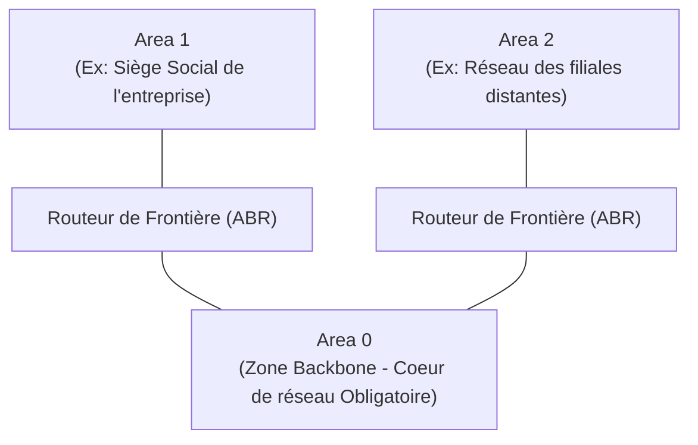

---
tags:
  - Reseau
  - Routage
  - OSPF
  - RIP
---

# Protocoles de Routage Dynamique

Les algorithmes mathématiques gérant la découverte automatique des réseaux mondiaux et d'entreprise.

## 1. Définition
Les protocoles de routage dynamique sont des logiciels de fond exécutés par les [routeurs réseau](../routage.md) qui leur permettent de "discuter" en permanence entre eux. Ils s'échangent automatiquement la liste des réseaux qu'ils connaissent, et calculent mathématiquement en direct le meilleur chemin pour acheminer un paquet IP vers sa destination.

## 2. Description / Fonctionnement
Plutôt que d'obliger l'administrateur à renseigner manuellement chaque route statique (ce qui est humainement intenable à grande échelle ou en cas de coupure inopinée d'un câble), l'administrateur active un protocole dynamique (ex: OSPF).
Pour choisir le meilleur chemin, le protocole se base sur une "note" appelée **Métrique**. Si plusieurs chemins existent pour atteindre la même destination, le chemin avec la métrique la plus faible gagne le droit de figurer dans la table de routage :
* **Le protocole historique RIP** : Sa métrique est le *Nombre de sauts* (de routeurs traversés). Aveugle à la vitesse des liens.
* **Le protocole moderne OSPF** : Sa métrique est le *Coût*, basé intelligemment sur la bande passante physique. (OSPF préfèrera faire un "détour" en traversant 3 routeurs reliés par une fibre optique ultra-rapide 10 Gbps, plutôt que d'aller "tout droit" sur 1 seul routeur relié par un câble ADSL très lent).

## 3. Utilisation / Cas Pratique
* **Sur le Réseau Local d'Entreprise (Routage IGP)** : Le standard absolu de l'industrie est **OSPF (Open Shortest Path First)**. Il divise les réseaux immenses en "Areas" (Zones) pour optimiser la mémoire des routeurs. Tous les routeurs de l'entreprise s'échangent la topologie globale en direct et réagissent en une fraction de seconde aux pannes de câbles.
* **Sur le grand Internet (Routage EGP)** : Le protocole mondial est le **BGP (Border Gateway Protocol)**. C'est lui qui gère le "Routage inter-domaine" entre les grands fournisseurs d'accès internationaux (Orange, Free, AT&T) et les géants du Cloud (Google, AWS, Netflix). Sa métrique n'est pas basée sur la vitesse pure, mais sur des règles géopolitiques et de coûts commerciaux très complexes.

## 4. Modifications possibles / Alternatives
**Le concept de Distance Administrative (AD)**
Si un routeur reçoit deux indications de chemins très différents pour rejoindre exactement la même destination (par exemple : l'une apprise dynamiquement via le protocole OSPF, l'autre forcée et saisie à la main par l'administrateur avec une route statique), il doit choisir à qui il fait le plus confiance. C'est la **Distance Administrative**. Plus la valeur est basse, plus la source d'information est jugée fiable :
* Route directement branchée sur une interface physique : AD = 0
* Route Statique (Renseignée manuellement) : AD = 1
* Protocole OSPF : AD = 110
* Protocole RIP : AD = 120

*Cas pratique : Entre une route manuelle et une route calculée par OSPF, le routeur de l'entreprise préfèrera **toujours** croire aveuglément la route manuelle de l'administrateur (car l'AD 1 l'emporte sur l'AD 110).*

## 5. Exemples visuels et Liens utiles

### Architecture OSPF (Division par Zones / Areas)

### RIP vs OSPF : Le match
| Critère technique | Protocole RIPv2 | Protocole OSPF |
| :--- | :--- | :--- |
| **Famille algorithmique** | Vecteur de distance (Ne voit que son voisin) | État de liens (Construit une carte complète du réseau) |
| **Métrique d'évaluation** | Nombre de sauts physiques (Bloqué à 15 max) | Coût de l'interface (Basé sur le débit réel du lien) |
| **Vitesse de convergence** (Adaptation à la panne)| Extrêmement Lente | Très Rapide |
| **Pertinence réseau moderne** | ❌ Obsolète, à éviter | ✅ Standard d'entreprise massivement recommandé |
