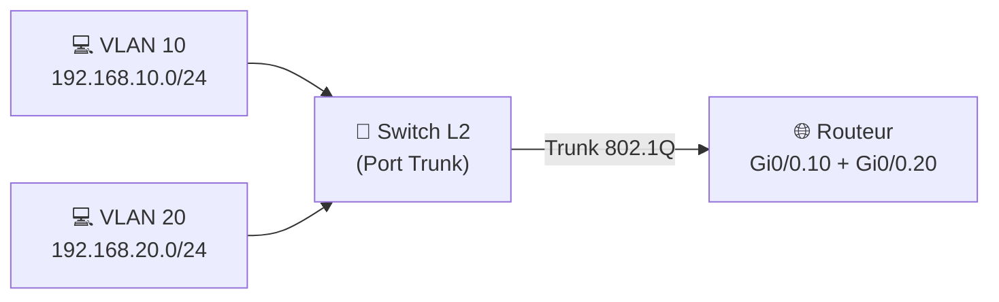

---
tags:
  - Reseau
  - Routage
  - VLAN
---

# Routeur, Routage et Routage Inter-VLAN

## Le Routeur

Un **routeur** est un équipement de couche 3 (réseau) dont le rôle est d'**acheminer les paquets IP entre différents réseaux**. Contrairement à un switch (couche 2) qui ne voit que les adresses MAC, le routeur prend ses décisions en lisant l'**adresse IP de destination**.

## La Table de Routage

Chaque routeur maintient une **table de routage** : une liste de réseaux connus et de l'interface (ou du prochain routeur, le *next-hop*) à utiliser pour les atteindre.

```bash
# Commande show ip route (Cisco)
C    192.168.1.0/24 is directly connected, GigabitEthernet0/0  ! Réseau directement connecté
S    10.0.0.0/8 [1/0] via 192.168.1.254                        ! Route statique
O    172.16.0.0/16 [110/20] via 192.168.2.1, OSPF              ! Route apprise par OSPF
R    0.0.0.0/0 [120/1] via 192.168.1.254, RIP                  ! Route par défaut (default gateway)
```

**Codes des routes :**

| Code | Signification |
| :---: | :--- |
| **C** | Connected — réseau directement connecté à une interface |
| **S** | Static — route configurée manuellement |
| **O** | OSPF — route apprise dynamiquement via OSPF |
| **R** | RIP — route apprise via RIP |
| **B** | BGP — route apprise via BGP (protocole d'Internet) |

## Types de routage

### Routage Statique
Les routes sont **configurées manuellement** par l'administrateur. Simple pour les petits réseaux, mais ne s'adapte pas automatiquement en cas de panne.

```bash
ip route 10.0.0.0 255.0.0.0 192.168.1.254   ! Vers le réseau 10.0.0.0/8, passer par .254
ip route 0.0.0.0 0.0.0.0 192.168.1.1        ! Route par défaut (default gateway)
```

### Routage Dynamique
Les routeurs échangent automatiquement leurs tables de routage via des **protocoles de routage**. Ils s'adaptent en temps réel aux pannes de liens.

| Protocole | Type | Usage |
| :--- | :--- | :--- |
| **RIP** (v2) | Distance Vector | Petits réseaux, obsolète |
| **OSPF** | Link State | Standard pour les réseaux d'entreprise |
| **EIGRP** | Hybride (Cisco) | Réseaux Cisco uniquement |
| **BGP** | Path Vector | Protocole d'Internet entre AS (FAI, cloud providers) |

---

## Routage Inter-VLAN

Par définition, les VLANs isolent les réseaux : un poste en [VLAN 10](vlan.md) ne peut pas communiquer avec un poste en VLAN 20 sans passer par un routeur (couche 3). C'est le **routage inter-VLAN**.

### Méthode 1 : Router-on-a-Stick (Sous-interfaces)

Un seul lien physique **trunk (802.1Q)** relie le switch au routeur. Le routeur crée des **sous-interfaces virtuelles**, une par VLAN, chacune avec sa propre adresse IP (passerelle du VLAN).

```bash
! Routeur (Router-on-a-Stick)
interface GigabitEthernet0/0.10
 encapsulation dot1Q 10                ! Tag VLAN 10
 ip address 192.168.10.254 255.255.255.0  ! Passerelle du VLAN 10

interface GigabitEthernet0/0.20
 encapsulation dot1Q 20
 ip address 192.168.20.254 255.255.255.0
```



### Méthode 2 : Switch de Couche 3 (SVIs)

Un **switch multicouche (L3)** peut router directement entre VLANs sans routeur externe, via des **SVI** (Switched Virtual Interface) : des interfaces virtuelles créées sur le switch, une par VLAN.

```bash
! Switch L3
interface Vlan10
 ip address 192.168.10.254 255.255.255.0
 no shutdown

interface Vlan20
 ip address 192.168.20.254 255.255.255.0
 no shutdown

ip routing   ! Active le routage IP sur le switch L3
```

**Avantage** : Le routage est fait en interne sur le switch, beaucoup plus rapide (ASIC hardware), sans lien physique trunk dédié vers un routeur externe.

| Critère | Router-on-a-Stick | Switch L3 (SVI) |
| :--- | :---: | :---: |
| Matériel nécessaire | Routeur + Switch L2 | Switch L3 uniquement |
| Performance | Limitée par le lien trunk | Très haute (hardware) |
| Simplicité | Simple à implémenter | Idéal pour les entreprises |
| Coût | Faible | Plus élevé (switch L3) |
