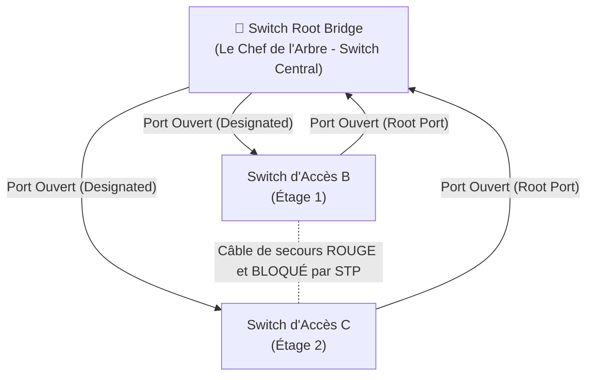

---
tags:
  - Reseau
  - STP
  - Spanning Tree
---

# Spanning Tree Protocol (STP)

Le protocole indispensable garant de la topologie physique et de l'absence de boucles réseau fatales.

## 1. Définition
Le **Spanning Tree Protocol (STP / IEEE 802.1D)** est un protocole de sécurité de couche 2 (Liaison de données, celle des [Trames Ethernet](Protocoles/ethernet_trames.md)) qui a pour rôle fondamental d'**éliminer les boucles logiques** dans les réseaux de Switchs tout en conservant et en autorisant un câblage de secours matériel redondant.

## 2. Description / Fonctionnement
Dans les armoires informatiques d'une entreprise, on relie très souvent les Switchs d'étage entre eux avec plusieurs câbles de secours en même temps (le but : si un câble est mordu par un rat ou coupé, le réseau d'étage continue de fonctionner). 
Le drame de la Couche 2, c'est qu'elle ne possède aucun mécanisme de durée de vie (pas de *TTL*) sur ses trames, contrairement aux paquets IP. 
Si une simple trame de Broadcast (ex: demande IP au réseau DHCP) se met à tourner en boucle dans ces câbles de secours branchés en rond, la trame se duplique à l'infini en une fraction de seconde : c'est la **Tempête de Broadcast** qui sature les puces des switchs et fait s'effondrer la totalité du réseau de l'entreprise.

**Le STP résout ce problème mortel en "bloquant" de manière virtuelle et automatique (Blocking State) les ports des câbles redondants**. Il trace un chemin unique, propre, et sans boucle (une forme mathématique d'Arbre - *Tree*). Si le câble principal de travail lâche, le STP s'en aperçoit et débloque le câble de secours (Forwarding State) pour rétablir la communication.

## 3. Utilisation / Cas Pratique
Le fonctionnement mathématique du STP s'articule autour de l'élection d'un "Chef d'orchestre", le **Root Bridge (Le pont racine)**.
Le switch central possédant le numéro de priorité matérielle le plus bas devient le Root Bridge. Ensuite, absolument tous les autres switchs du réseau calculent la distance la plus courte pour le rejoindre. Ils laissent le port le plus proche ouvert, et décident de bloquer de force tous les autres câbles inutiles qui risqueraient de former une boucle.

## 4. Modifications possibles / Alternatives
Le problème historique majeur du vieux STP (Norme 802.1D des années 90) est son incroyable lenteur : quand un câble est physiquement cassé, le STP met entre 30 et 50 secondes pour analyser le réseau et oser débloquer le câble de secours. Cela provoque une coupure réseau très douloureuse pour la téléphonie et les applications.

**L'alternative moderne indispensable est le RSTP (Rapid Spanning Tree - 802.1w)** : Il s'agit du standard mondial actuel. Grâce à de nouveaux mécanismes de négociation explicite de switch à switch, il "converge" (s'adapte à une panne) en **moins d'une seconde**.

**PortFast et BPDU Guard** :
Sur les Switchs d'accès, les ports qui sont branchés à des PC de bureau ou à des Serveurs finaux ne causeront logiquement jamais de boucle de switch. L'administrateur active donc la configuration **PortFast** sur ces ports : cela ordonne au STP de ne pas analyser le port au démarrage et de l'ouvrir immédiatement (le PC ne doit pas attendre 30 secondes pour avoir du réseau).
En contrepartie, par sécurité drastique, on y greffe le mécanisme **BPDU Guard** : si un employé mal intentionné branche en douce un switch de maison sur cette prise murale "PortFast", le BPDU Guard détecte la trame du switch et "éteint / coupe" la prise murale instantanément.

## 5. Exemples visuels et Liens utiles

### Architecture de blocage STP Simplifiée

### Les États classiques d'un port sous STP (802.1D)
| État du port | Comportement sur le réseau |
| :--- | :--- |
| **Blocking** (Port Bloqué) | Le port est verrouillé logiquement pour empêcher la boucle fatale. |
| **Listening** (Phase d'Écoute) | Transition. Le port analyse les annonces STP des switchs voisins. |
| **Learning** (Apprentissage) | Transition. Le switch mémorise silencieusement les adresses MAC. |
| **Forwarding** (Acheminement Actif) | Le port est sain, il laisse passer les trames réseau normales. |
