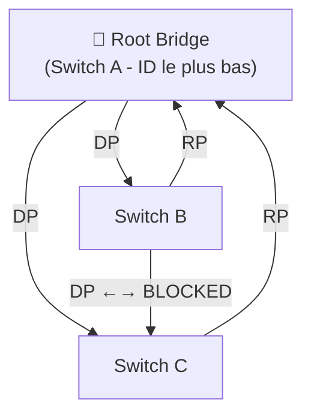

---
tags:
  - Reseau
  - STP
  - Spanning Tree
---

# Spanning Tree Protocol (STP)

Le **Spanning Tree Protocol (STP)** est un protocole de couche 2 qui permet d'**éliminer les boucles** dans les réseaux commutés (switches) tout en maintenant une **redondance physique** des liens.

## Pourquoi STP est-il nécessaire ?

Dans un réseau avec plusieurs switches interconnectés, il est courant de câbler des liens en redondance pour éviter les SPOF. Sans STP, ces boucles physiques provoquent des **tempêtes de broadcast** : les trames se multiplient à l'infini sur le réseau et le saturent complètement.

**STP résout ce problème en bloquant logiquement certains ports**, tout en conservant les câbles comme chemin de secours.

## Fonctionnement de STP (802.1D)

### Étape 1 : Élection du Root Bridge
Le **Root Bridge** est le centre de l'arbre STP. Il est élu en fonction du **Bridge ID** = Priorité (défaut: 32768) + Adresse MAC. Le Bridge ID le plus bas est élu.

### Étape 2 : Calcul du chemin vers le Root Bridge
Chaque switch calcule le chemin le plus court (en **coût STP**) vers le Root Bridge.

| Vitesse du lien | Coût STP (802.1D) |
| :---: | :---: |
| 10 Mbps | 100 |
| 100 Mbps | 19 |
| 1 Gbps | 4 |
| 10 Gbps | 2 |

### Étape 3 : Attribution des rôles aux ports

| Rôle | Description | État |
| :--- | :--- | :---: |
| **Root Port (RP)** | Port offrant le meilleur chemin vers le Root Bridge | Forwarding |
| **Designated Port (DP)** | Port sélectionné pour chaque segment réseau | Forwarding |
| **Blocked Port (BP)** | Port redondant mis en veille pour casser la boucle | Blocking |



## États des ports STP (802.1D)

| État | Durée | Description |
| :--- | :---: | :--- |
| **Blocking** | — | Reçoit les BPDU, ne transmet pas de données |
| **Listening** | 15s | Participe à l'élection, ne transmet pas |
| **Learning** | 15s | Construit la table MAC, ne transmet pas |
| **Forwarding** | — | Transmet normalement les données |
| **Disabled** | — | Port administrativement désactivé |

> **Temps de convergence STP (802.1D) : ~30 à 50 secondes.** C'est le principal défaut de STP classique.

## RSTP — Rapid STP (802.1w)

**RSTP** (Rapid Spanning Tree Protocol) est l'évolution moderne de STP. Il remplace les timers par un mécanisme de **négociation explicite** entre switches, réduisant le temps de convergence à **moins de 1 seconde** dans les conditions optimales.

| Caractéristique | STP (802.1D) | RSTP (802.1w) |
| :--- | :---: | :---: |
| Convergence | 30 à 50s | < 1s |
| Rôles de ports | 3 | 5 (+ Alternate, Backup) |
| Compatibilité | — | Rétrocompatible avec STP |
| Standard recommandé | ❌ Obsolète | ✅ **Utiliser RSTP** |

## MSTP — Multiple STP (802.1s)

**MSTP** permet de faire tourner **plusieurs instances STP** sur un seul switch, une par groupe de VLANs. Cela permet d'équilibrer le trafic sur des liens redondants en dédiant chaque chemin à certains VLANs.

## Commandes Cisco

```bash
! Vérifier STP
show spanning-tree                    ! Vue générale STP par VLAN
show spanning-tree vlan 10            ! STP pour un VLAN spécifique

! Forcer un switch à être Root Bridge
spanning-tree vlan 10 priority 4096  ! Priorité basse = Root Bridge préféré
spanning-tree vlan 10 root primary    ! Commande raccourcie

! Activer RSTP
spanning-tree mode rapid-pvst         ! Rapid-PVST+ (RSTP par VLAN, Cisco)

! PortFast : convergence immédiate sur les ports accès (PC/serveurs uniquement !)
interface FastEthernet0/1
 spanning-tree portfast               ! JAMAIS sur un port connecté à un switch
 spanning-tree bpduguard enable       ! Bloque le port si une BPDU est reçue (sécurité)
```

> [!IMPORTANT]
> **PortFast + BPDU Guard** : Activer PortFast uniquement sur les ports reliés à des postes finaux (PC, serveurs). Si un switch est accidentellement branché dessus, **BPDU Guard** désactivera immédiatement le port pour éviter les boucles.
