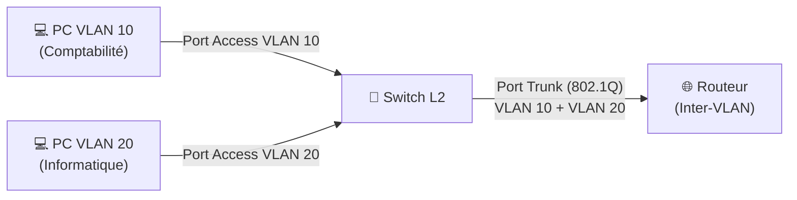

---
tags:
  - Reseau
  - VLAN
  - Segmentation
---

# VLAN et Segmentation Réseau

Un **VLAN** (Virtual Local Area Network) est un réseau local virtuel qui permet de **segmenter logiquement** un réseau physique en plusieurs réseaux indépendants, même si les équipements partagent la même infrastructure physique (même switch).

## Pourquoi segmenter ?

Sans VLAN, tous les équipements sur un réseau partagent le même **domaine de broadcast** : un simple broadcast atteint tout le monde, et tout le monde peut "voir" le trafic des autres.

**Bénéfices des VLANs :**
* **Sécurité** : Isolation logique entre les services (un poste du VLAN Comptabilité ne peut pas accéder directement au serveur de Production).
* **Performance** : Réduit la taille des domaines de broadcast, donc le bruit réseau.
* **Flexibilité** : Regrouper des équipements par fonction (VLAN Serveurs, VLAN RH, VLAN Imprimantes) indépendamment de leur localisation physique.
* **Simplification de l'administration** : Déplacer un poste de VLAN = changement de configuration sur le switch, pas de câblage.

## Fonctionnement : Ports Access et Trunk

### Port Access
Un port **access** est configuré pour appartenir à **un seul VLAN**. Le poste connecté ne "sait" pas qu'il est dans un VLAN, il croit être sur un réseau normal.

### Port Trunk (802.1Q)
Un port **trunk** transporte le trafic de **plusieurs VLANs** simultanément, en ajoutant un **tag 802.1Q** dans l'entête Ethernet pour identifier à quel VLAN appartient chaque trame. Utilisé entre les switches et entre un switch et un routeur.



## Architecture de VLANs recommandée

| VLAN ID | Nom | Contenu typique |
| :---: | :--- | :--- |
| **10** | VLAN_SERVEURS | Serveurs de production |
| **20** | VLAN_UTILISATEURS | Postes de travail |
| **30** | VLAN_MGMT | Interfaces de management (iDRAC, IPMI, switch admin) |
| **40** | VLAN_DMZ | Serveurs exposés (web, mail) |
| **50** | VLAN_VOIP | Téléphones IP |
| **60** | VLAN_INVITES | Réseau Wi-Fi pour les visiteurs (isolé d'internet uniquement) |
| **99** | VLAN_NATIF | VLAN natif (non taggé) des trunks |

> [!IMPORTANT]
> Le **VLAN de management** (accès aux interfaces d'admin) doit être isolé et accessible uniquement depuis les postes des administrateurs. Changer le VLAN natif pour qu'il ne soit pas le VLAN 1 par défaut.

## Commandes Cisco (Switch L2/L3)

```bash
! Créer un VLAN
vlan 10
 name VLAN_SERVEURS

! Configurer un port Access
interface FastEthernet0/1
 switchport mode access
 switchport access vlan 10

! Configurer un port Trunk
interface GigabitEthernet0/1
 switchport mode trunk
 switchport trunk allowed vlan 10,20,30

! Vérification
show vlan brief
show interfaces trunk
```

## Voir aussi
- [Routage inter-VLAN](routage.md)
- [ACL — Contrôle des flux entre VLANs](acl.md)
- [Proxy et Pare-feu](Securite/proxy_firewall.md)
