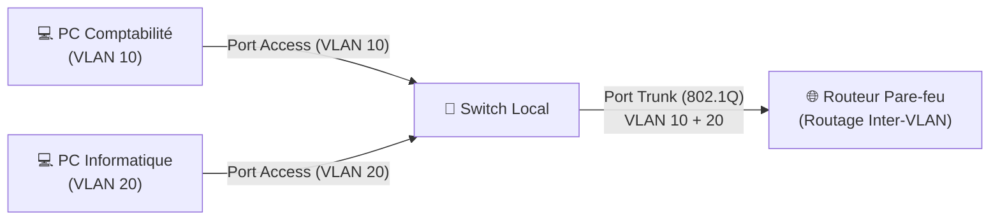

---
tags:
  - Reseau
  - VLAN
  - Segmentation
---

# VLAN et Segmentation Réseau

Mécanisme permettant de diviser un réseau physique en plusieurs réseaux virtuels isolés.

## 1. Définition
Un **VLAN** (Virtual Local Area Network) est un réseau local virtuel. Il permet de segmenter logiquement un réseau physique en plusieurs domaines de diffusion (Broadcast Domains) totalement indépendants, et ce, même si les équipements sont physiquement branchés sur le même switch.

## 2. Description / Fonctionnement
Chaque VLAN agit comme un switch séparé et possède son propre sous-réseau IP. Un équipement dans le VLAN 10 ne peut pas communiquer directement avec un équipement du VLAN 20 sans passer par un routeur (routage inter-VLAN).
Deux types de ports existent sur les switchs pour gérer les VLANs :
* **Port Access** : Le port du switch appartient à un seul VLAN. Le PC branché dessus reçoit du trafic standard sans étiquette ; il n'a pas conscience d'être dans un VLAN.
* **Port Trunk (802.1Q)** : Le port transporte le trafic de *plusieurs* VLANs en même temps. Il ajoute une "étiquette" (Tag 802.1Q) sur chaque trame Ethernet pour indiquer au switch voisin à quel VLAN elle appartient. Utilisé pour relier les switchs entre eux ou vers un routeur.

## 3. Utilisation / Cas Pratique
Les VLANs sont fondamentaux en entreprise pour la sécurité, les performances (limitation du bruit broadcast) et l'organisation logique.
Exemple d'architecture recommandée :
* **VLAN 10** : Serveurs de production.
* **VLAN 20** : Postes Utilisateurs.
* **VLAN 30** : Administration IT (Hyperviseurs, Switchs).
* **VLAN 50** : Téléphones IP (VoIP).
* **VLAN 60** : Wi-Fi Visiteurs (strictement isolé, accès vers Internet uniquement).

## 4. Modifications possibles / Alternatives
Pour faire communiquer le VLAN Serveurs et le VLAN Utilisateurs, on déploie un routeur ou un pare-feu au centre (Routage L3).
Pour les Data Centers géants, la limite technique de 4096 VLANs est problématique. Le SDN (Software-Defined Networking) ou le **VXLAN** sont les évolutions modernes majeures pour gérer la micro-segmentation à très grande échelle.

## 5. Exemples visuels et Liens utiles

### Architecture Trunk et Access


### Exemple : Commandes de configuration Cisco
```bash
! Créer le VLAN 10
vlan 10
 name VLAN_SERVEURS
 
! Assigner un port PC (Access)
interface FastEthernet0/1
 switchport mode access
 switchport access vlan 10
 
! Assigner un port vers le routeur (Trunk)
interface GigabitEthernet0/1
 switchport mode trunk
 switchport trunk allowed vlan 10,20
```
