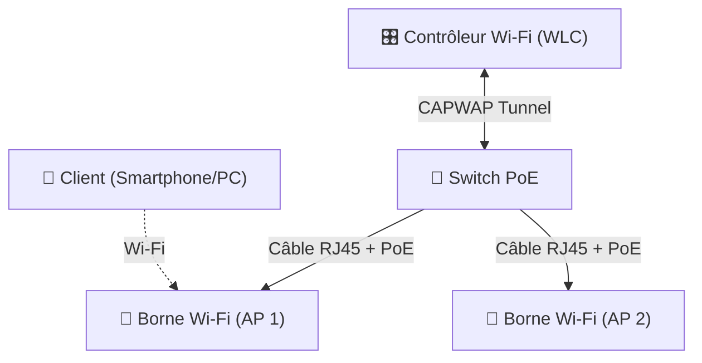

---
tags:
  - Reseau
  - Sans Fil
  - Wi-Fi
  - Securite
---

# Wi-Fi et Réseaux Sans Fil (802.11)

La famille de normes **IEEE 802.11** définit la communication réseau sans fil (WLAN).

## 1. Normes et Fréquences Wi-Fi

Historiquement, le Wi-Fi utilisait des appellations techniques complexes. Depuis 2018, la Wi-Fi Alliance a simplifié la nomenclature avec des numéros de génération (Wi-Fi 4, 5, 6, 7).

| Norme IEEE | Nom Commercial | Fréquence(s) | Débit max théorique | Année |
| :--- | :--- | :--- | :--- | :--- |
| **802.11n** | **Wi-Fi 4** | 2.4 GHz et 5 GHz | 600 Mbps | 2009 |
| **802.11ac** | **Wi-Fi 5** | 5 GHz uniquement | 3.5 Gbps | 2014 |
| **802.11ax** | **Wi-Fi 6** | 2.4 GHz et 5 GHz | 9.6 Gbps | 2019 |
| **802.11ax** | **Wi-Fi 6E** | 2.4, 5 et **6 GHz** | 9.6 Gbps | 2021 |
| **802.11be** | **Wi-Fi 7** | 2.4, 5 et 6 GHz | **46 Gbps** | 2024 |

> [!TIP]
> **2.4 GHz vs 5 GHz**
> - **2.4 GHz** : Les ondes pénètrent mieux les murs et portent plus loin. Inconvénient : très saturé et perturbé (Bluetooth, micro-ondes).
> - **5 GHz** : Débits très élevés et bande peu encombrée. Inconvénient : porte moins loin et traverse mal les obstacles denses.

## 2. Architecture Wi-Fi d'Entreprise

Dans un contexte domestique, la "box" fait office de routeur, switch et point d'accès Wi-Fi (AP). En entreprise, l'architecture est centralisée :

* **AP (Access Point)** : Les bornes qui diffusent le réseau (Lightweight AP ou AP autonomes).
* **WLC (Wireless LAN Controller)** : Le "cerveau" central. Les bornes légères s'y connectent pour recevoir leur configuration. Le WLC gère le **roaming** (le passage fluide d'un client d'une borne à une autre sans coupure).
* **PoE (Power over Ethernet)** : Les AP sont alimentés via leur [câble RJ45](cablage.md) depuis les switches.
* **SSID (Service Set Identifier)** : Le "Nom du réseau" diffusé.

## 3. Sécurité Sans Fil

Les protocoles de sécurité Wi-Fi chiffrent le trafic dans l'air pour empêcher l'écoute (sniffing).

| Protocole | Sécurité | Fonctionnement |
| :--- | :---: | :--- |
| **WEP** | ❌ Très faible | Craquable en quelques minutes (initialisation IV défectueuse). Abandonné. |
| **WPA** | ❌ Faible | Utilisait le protocole TKIP. Abandonné (vulnérable à la fragmentation). |
| **WPA2** | ✅ Robuste | Norme standard actuelle. Utilise le chiffrement robuste **AES (CCMP)**. Vulnérable uniquement au *KRACK attack* ou au brute-force du handshake. |
| **WPA3** | 🔒 Optimal | Nouveau standard (2018). Remplace le pre-shared key (PSK) par l'échange **SAE (Simultaneous Authentication of Equals)**. Protège contre les attaques hors-ligne par dictionnaire. |

### Les modes d'authentification WPA2/WPA3

Dans le standard, WPA2 et WPA3 se déclinent chacun en deux modes d'authentification :

* **Mode "Personal" (ou PSK - Pre-Shared Key)** : 
  * Tous les utilisateurs partagent un **même mot de passe (clé unique)**.
  * Utilisé à domicile ou pour des réseaux invités simples (Captive Portal).
* **Mode "Enterprise" (ou 802.1X/RADIUS)** : 
  * Il n'y a pas de clé partagée. Chaque utilisateur s'authentifie avec **son compte individuel** (identifiant + mot de passe, ou certificat AD).
  * Repose sur la norme **[802.1X et un serveur RADIUS/NPS](802.1Q_802.1X.md)**.
  * *Avantage majeur* : Si le compte d'un employé est désactivé dans l'Active Directory, il perd automatiquement accès au Wi-Fi. Impossible avec une clé PSK.
  * *Avantage supplémentaire* : Permet des [VLANs dynamiques](../vlan.md) basés sur le profil de l'utilisateur.
