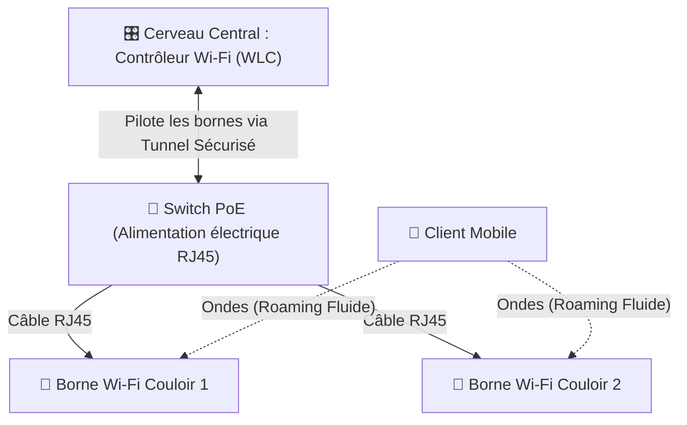

---
tags:
  - Reseau
  - Sans Fil
  - Wi-Fi
  - Securite
---

# Wi-Fi et Réseaux Sans Fil (802.11)

Le standard mondial de la communication réseau sans fil par ondes radio.

## 1. Définition
Le Wi-Fi est un ensemble de protocoles de communication permettant de relier des équipements informatiques au sein d'un réseau local sans fil (WLAN) par l'émission d'ondes radio, évitant ainsi le recours massif au câblage physique. Ses normes technologiques sont dictées par le standard international IEEE 802.11.

## 2. Description / Fonctionnement
Le Wi-Fi évolue par "Générations" successives qui améliorent drastiquement les débits bruts et la gestion simultanée d'un grand nombre d'appareils connectés (forte densité), en exploitant historiquement deux bandes de fréquences majeures :
* **2.4 GHz** : Les ondes pénètrent très bien les murs et portent loin, mais c'est une bande historiquement saturée, lente, et extrêmement polluée (Bluetooth, fours micro-ondes).
* **5 GHz** : Offre des débits massifs et très stables, mais la portée radio est beaucoup plus faible et les ondes traversent très mal les gros obstacles matériels (murs porteurs en béton).

L'innovation des nouvelles normes (Wi-Fi 6E et le Wi-Fi 7) est l'ouverture d'une toute nouvelle autoroute vierge : la bande des **6 GHz**.

## 3. Utilisation / Cas Pratique
Dans un environnement domestique, la "Box" Internet opérateur fait tout le travail (Routeur, Switch et Point d'accès).
**En environnement d'entreprise**, l'architecture est centralisée et beaucoup plus intelligente :
L'équipe informatique installe des dizaines de **Bornes (Access Points - AP)** aux plafonds des couloirs. Ces bornes sont souvent "bêtes" et gérées par un cerveau central en salle serveur : le **WLC (Wireless LAN Controller)**. C'est ce WLC centralisé qui permet le *Roaming* réseau : quand un médecin marche dans le couloir d'un hôpital avec sa tablette, le WLC transfère sa connexion d'une borne à l'autre en une fraction de seconde, sans que sa visioconférence critique ne subisse la moindre coupure.

## 4. Modifications possibles / Alternatives
**Sécurité Wi-Fi : L'authentification**
En plus du chiffrement mathématique robuste (WPA2 ou le très récent WPA3) qui brouille les ondes dans l'air, il existe deux manières majeures d'autoriser l'accès au Wi-Fi :
* **Le mode "Personal" (PSK)** : Le mot de passe (la clé) est le même pour tous les employés. Danger : si un employé part avec la clé, ou la perd, il faut la changer partout sur tous les appareils de l'entreprise.
* **Le mode "Enterprise" (802.1X / RADIUS)** : Il n'y a pas de clé globale. Chaque employé se connecte au Wi-Fi avec son propre compte Windows individuel (via l'annuaire Active Directory et un serveur NPS). Dès qu'un employé quitte l'entreprise, son compte Active Directory est clôturé, et il perd automatiquement son accès Wi-Fi de manière ultra-sécurisée sans perturber ses collègues.

## 5. Exemples visuels et Liens utiles

### Mémento des Normes Wi-Fi
| Nom commercial simplifé | Norme IEEE | Bandes de Fréquences | Vitesse Max Théorique |
| :--- | :--- | :--- | :--- |
| **Wi-Fi 4** | 802.11n | 2.4 et 5 GHz | 600 Mbps |
| **Wi-Fi 5** | 802.11ac | 5 GHz uniquement | 3.5 Gbps |
| **Wi-Fi 6** | 802.11ax | 2.4 et 5 GHz | 9.6 Gbps |
| **Wi-Fi 6E** | 802.11ax | 2.4, 5 et **6 GHz** | 9.6 Gbps |
| **Wi-Fi 7** (2024) | 802.11be | 2.4, 5 et 6 GHz | **46 Gbps** |

### Architecture Wi-Fi Centralisée (Entreprise)

