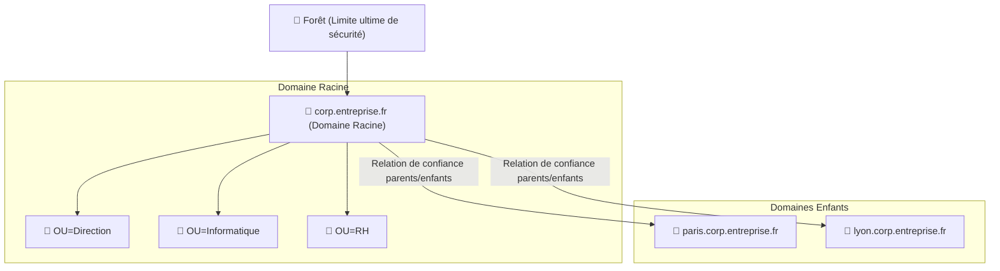

---
tags:
  - Systeme
  - Active Directory
  - Windows
---

# Forêts, Domaines et leur Structure

L'Active Directory organise les ressources selon une hiérarchie précise à trois niveaux : la **Forêt**, les **Domaines**, et les **Unités d'Organisation (OU)**. Comprendre cette structure est fondamental pour toute gestion d'infrastructure Windows.

## La Hiérarchie AD

## La Forêt

**La forêt est la frontière de sécurité absolue du réseau.**

* Une forêt est un ensemble d'un ou plusieurs **domaines** qui partagent un **schéma AD unique** (la même structure de données) et un **Catalogue Global commun**.
* Par défaut, les ressources au sein d'une même forêt se font mutuellement confiance grâce à des **relations de confiance transitives automatiques**.
* Deux forêts distinctes sont **totalement isolées** : aucun accès mutuel n'est possible sans création d'une relation de confiance explicite entre elles.

> [!IMPORTANT]
> **Forêt ≠ Sécurité applicative.** Un administrateur de domaine compromis peut potentiellement compromettre toute la forêt. Pour un cloisonnement total entre deux entités (ex: filiales sensibles), il faut **deux forêts distinctes**.

## Les Domaines

Un domaine est une **unité d'administration autonome** au sein d'une forêt. Il possède :
* Sa propre **base de données d'objets** (utilisateurs, ordinateurs...).
* Ses propres **stratégies de groupe (GPO)** et ses propres **administrateurs** de domaine.
* Ses propres [**rôles FSMO**](ad_fsmo.md) (PDC Emulator, RID Master, Infrastructure Master).

### Domaine Racine et Domaines Enfants

Une forêt possède **un seul domaine racine** (le premier créé), qui donne son nom à la forêt. Les domaines créés ensuite en dessous sont des **domaines enfants**. Ils héritent du nom DNS (ex : `paris.corp.entreprise.fr`) et sont automatiquement liés au domaine parent par des **relations de confiance transitives bidirectionnelles**.

## Le Catalogue Global (CG)

Le Catalogue Global est une **base de données partielle et en lecture seule** qui contient un sous-ensemble d'attributs de **tous les objets de toute la forêt**.

* **Utilité** : Permet à un utilisateur de Domaine A de rechercher et accéder à des ressources de Domaine B sans interroger chaque contrôleur de domaine un par un.
* **En pratique** : Un ou plusieurs DCs dans chaque site sont désignés comme **serveurs catalogue global**.

## Les Relations de Confiance (*Trusts*)

Les relations de confiance définissent comment deux entités AD se font mutuellement confiance pour l'authentification.

| Type de confiance | Créée | Transitivité | Direction |
| :--- | :---: | :---: | :---: |
| **Parents-Enfants** | Automatiquement | Transitive | Bidirectionnelle |
| **Arbres (Tree-root)** | Automatiquement | Transitive | Bidirectionnelle |
| **Externe** | Manuellement | Non transitive | Uni ou Bi |
| **Forêt-à-Forêt** | Manuellement | Transitive (dans les forêts) | Uni ou Bi |
| **Raccourci (Shortcut)** | Manuellement | Transitive | Uni ou Bi |
| **Realm** | Manuellement | Transitive ou non | Uni ou Bi |

> **Transitive** signifie que si A fait confiance à B, et B fait confiance à C, alors A fait implicitement confiance à C.

## Les Unités d'Organisation (OU)

Les OU sont des **conteneurs** à l'intérieur d'un domaine qui permettent de :
* **Organiser** les objets (utilisateurs, ordinateurs) de façon logique (par service, par site géographique...).
* **Déléguer** l'administration d'une OU à des administrateurs spécifiques sans leur donner les droits sur tout le domaine.
* **Appliquer des GPO** ciblées sur un sous-ensemble d'objets.
