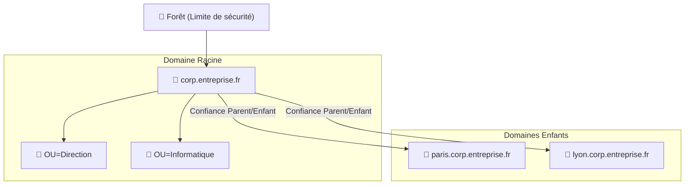

---
tags:
  - Systeme
  - Active Directory
  - Windows
---

# Forêts, Domaines et leur Structure

La hiérarchie fondamentale d'organisation des ressources dans Active Directory.

## 1. Définition
L'Active Directory organise les ressources selon une hiérarchie précise à trois niveaux : la **Forêt** (limite ultime de sécurité), le **Domaine** (unité d'administration autonome), et l'**Unité d'Organisation (OU)** (conteneur d'objets).

## 2. Description / Fonctionnement
* **La Forêt** : C'est l'ensemble d'un ou plusieurs domaines partageant un "Schéma AD" (structure de la base de données) unique et un Catalogue Global commun. Les domaines d'une même forêt se font confiance automatiquement.
* **Le Domaine** : Possède sa propre base de données d'utilisateurs, ses propres GPO, et ses propres rôles FSMO. Le premier créé est le "domaine racine", les suivants en dessous sont les "domaines enfants" (ex: `paris.corp.entreprise.fr`).
* **Les OUs** : Des dossiers logiques dans le domaine permettant d'organiser les utilisateurs et les ordinateurs pour y appliquer des stratégies ciblées.

## 3. Utilisation / Cas Pratique
* L'administrateur utilise de multiples OUs pour séparer le service des "Ressources Humaines" de celui de "l'Informatique", afin de leur appliquer des GPO différentes et de déléguer des droits d'administration précis.
* On utilise un nouveau "Domaine Enfant" lorsqu'une entreprise veut décentraliser l'administration réseau d'une filiale de grande envergure.
* On crée une nouvelle "Forêt" totalement distincte lorsqu'on souhaite un cloisonnement de sécurité absolu, par exemple entre un réseau militaire et un réseau administratif.

## 4. Modifications possibles / Alternatives
Les relations de confiance (*Trusts*) permettent de lier deux forêts ou domaines initialement séparés. Elles peuvent être manuelles ou automatiques, uni ou bi-directionnelles, transitives ou non.
Le **Catalogue Global (CG)** est un rôle optionnel (mais critique) de serveur contenant une copie en lecture seule de tous les objets de l'ensemble de la forêt, accélérant considérablement les recherches inter-domaines.

## 5. Exemples visuels et Liens utiles

### Architecture Active Directory

