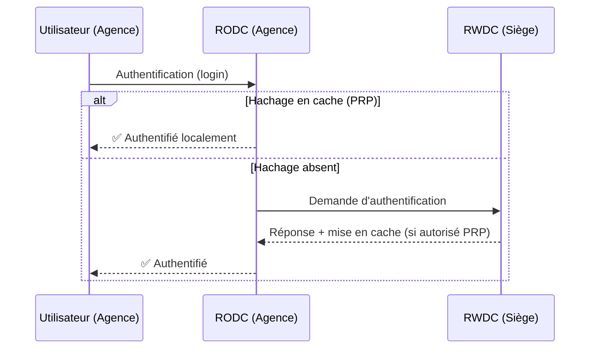

---
tags:
  - Systeme
  - Active Directory
  - Windows
---

# Types de Contrôleurs de Domaine (DC)

Un **Contrôleur de Domaine (DC)** est le serveur qui héberge la base de données Active Directory et qui répond aux requêtes d'authentification. Il existe plusieurs types de DCs, chacun adapté à des scénarios différents.

## RWDC – Read/Write Domain Controller

C'est le **contrôleur de domaine standard**, qui possède une copie **complète et modifiable** de la base de données AD.

* Il peut traiter toutes les opérations : création/modification/suppression d'objets, authentification, réplication bidirectionnelle.
* Au minimum **deux RWDCs** par domaine sont recommandés pour la tolérance aux pannes.
* En l'absence du RWDC principal, l'autre prend le relais de façon transparente.

## RODC – Read-Only Domain Controller

Le RODC est un DC "en lecture seule". Il possède une **copie non modifiable** de la base AD.

### Cas d'usage : Les sites distants (Agences)

Un RODC est typiquement déployé dans un **bureau distant ou une agence** qui n'a pas de local serveur sécurisé (pas de salle informatique verrouillée, personnel non IT sur place).

### Pourquoi le RODC est-il plus sûr ?

| Fonctionnalité | RWDC | RODC |
| :--- | :---: | :---: |
| Peut authentifier les utilisateurs | ✅ | ✅ (localement) |
| Peut être modifié directement | ✅ | ❌ |
| Stocke les mots de passe (hachages) | Tous | Seulement ceux autorisés (PRP) |
| Impact si volé/compromis | **Critique** | **Limité** |

> **PRP (Password Replication Policy)** : Sur un RODC, seuls les hachages de mots de passe des utilisateurs explicitement autorisés dans la liste blanche PRP sont mis en cache localement. Si le RODC est volé, l'attaquant n'obtient que les comptes de la liste blanche, et non tout le domaine. La révocation est simple : réinitialiser les mots de passe de la liste blanche uniquement.

### Fonctionnement détaillé du RODC

### Administrateur RODC local délégué

Il est possible de déléguer l'administration locale d'un RODC (redémarrage, mises à jour) à un utilisateur **sans lui donner des droits sur l'ensemble du domaine**. Idéal pour désigner un référent informatique dans une agence.

## ADC – Additional Domain Controller

Ce n'est pas un type officiel distinct, mais le terme désigne simplement un **RWDC supplémentaire** déployé pour la **redondance et la répartition de charge**. Il est identique au DC principal (premier DC installé) et participe à la réplication multi-maîtres.

## Serveur Catalogue Global (CG)

Ce n'est pas vraiment un "type" de DC, mais un **rôle supplémentaire** que l'on peut activer sur un RWDC ou un RODC.

* Un DC Catalogue Global héberge une copie partielle (mais indexée) de tous les attributs de **tous les objets de toute la forêt**, pas juste du domaine local.
* Il est indispensable pour la recherche d'objets inter-domaines et pour la connexion des utilisateurs UPN (*User Principal Name*).
* **Bonne pratique** : Il est recommandé de faire de **tous les DCs des serveurs CG** dans les forêts modernes, sauf cas particulier.

## Tableau comparatif général

| Type | Modifiable | Mots de passe | Use case principal |
| :--- | :---: | :---: | :--- |
| **RWDC** | ✅ Oui | Tous les comptes | Siège / Datacenter |
| **RODC** | ❌ Non (lecture seule) | Liste blanche PRP seulement | Agences / Sites distants non sécurisés |
| **ADC (RWDC sup.)** | ✅ Oui | Tous les comptes | Redondance / Haute disponibilité |
| **+ Rôle CG** | (selon DC de base) | (selon DC de base) | Recherche inter-domaines, auth. UPN |
