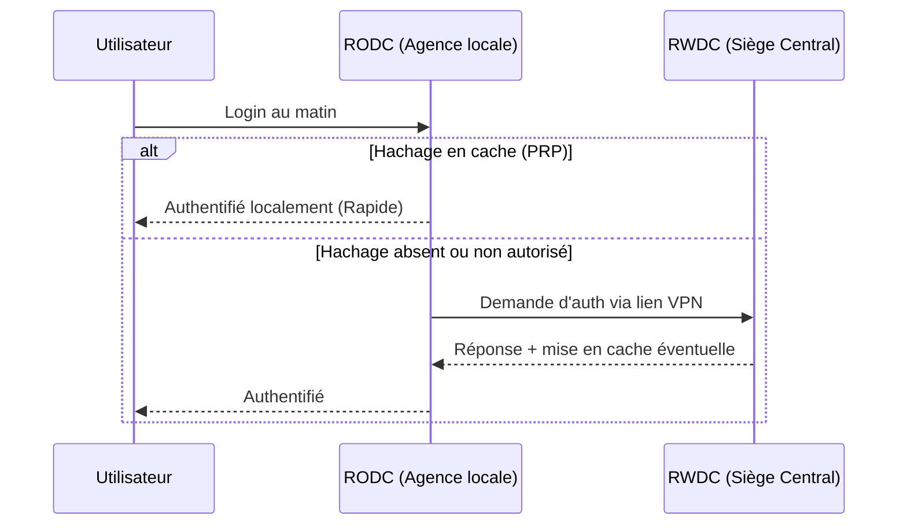

---
tags:
  - Systeme
  - Active Directory
  - Windows
---

# Types de Contrôleurs de Domaine (DC)

Serveurs hébergeant la base Active Directory (RWDC, RODC, ADC).

## 1. Définition
Un **Contrôleur de Domaine (DC)** est un serveur Windows qui héberge la base de données de l'annuaire Active Directory et traite les requêtes d'authentification des utilisateurs (Logon). Il en existe plusieurs types pour s'adapter à la sécurité physique et à la redondance des différents sites de l'entreprise.

## 2. Description / Fonctionnement
* **RWDC (Read/Write Domain Controller)** : C'est le contrôleur standard. Il possède une copie complète et totalement modifiable de la base AD.
* **RODC (Read-Only Domain Controller)** : C'est un DC en "lecture seule". Il ne peut pas être modifié directement, les changements proviennent tous des RWDCs.
* **ADC (Additional Domain Controller)** : Ce terme désigne simplement un 2ème ou 3ème RWDC ajouté au réseau pour la répartition de charge et la tolérance aux pannes (redondance).

## 3. Utilisation / Cas Pratique
* **RWDC / ADC** : Ils sont déployés au siège social ou dans des Datacenters hypersécurisés. Il en faut au strict minimum 2 par domaine.
* **RODC** : Il est déployé dans une petite agence ou un bureau distant ne disposant pas de local informatique sécurisé. Si le serveur physique est volé par un intrus, l'impact de sécurité global sur l'entreprise est drastiquement limité.

## 4. Modifications possibles / Alternatives
Le RODC inclut une fonctionnalité de sécurité vitale : la **PRP (Password Replication Policy)**. Un RODC ne stocke *aucun* mot de passe par défaut. Il faut explicitement autoriser certains comptes (la liste blanche PRP) pour que leurs hachages de mots de passe soient mis en cache localement et accélérer leur connexion. En cas de vol, seul un nombre très limité de mots de passe devra être réinitialisé en urgence.

Le **Catalogue Global (CG)** est un rôle supplémentaire souvent activé sur tous les DCs modernes. Il indexe partiellement toute la forêt pour accélérer la recherche globale et les connexions UPN (ex: `jean.dupont@corp.fr`).

## 5. Exemples visuels et Liens utiles

### Tableau Comparatif
| Type | Base Modifiable | Stockage des mots de passe | Use case principal |
| :--- | :---: | :---: | :--- |
| **RWDC** | ✅ Oui | Tous les comptes | Siège / Datacenter |
| **RODC** | ❌ Non (lecture seule) | Liste blanche PRP seulement | Agences physiques non sécurisées |
| **ADC** | ✅ Oui | Tous les comptes | Redondance / Haute disponibilité |

### Authentification via un RODC (Agence distante)

