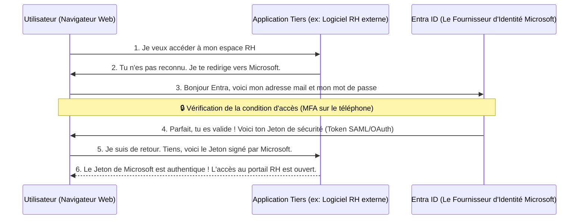

---
tags:
  - Systeme
  - Cloud
  - Identité
  - Microsoft
---

# Microsoft Entra ID (Ex Azure AD)

La gestion moderne et centralisée des identités et des accès (IAM) dans le Cloud Microsoft.

## 1. Définition
**Microsoft Entra ID** (universellement connu sous son ancien nom : *Azure Active Directory* ou *Azure AD*) est le service Microsoft 100% Cloud de gestion des identités et des accès. Il agit comme un gigantesque annuaire mondial qui permet aux employés de s'authentifier de manière sécurisée pour accéder à Microsoft 365 (Word, Teams, Outlook), au portail Cloud Azure, et à des milliers d'autres applications Web externes (SaaS).

## 2. Description / Fonctionnement
Contrairement à [l'Active Directory traditionnel On-Premise](ad_forets_domaines.md) qui utilise de vieux protocoles pensés pour des câbles de réseau local d'entreprise (Kerberos, NTLM, LDAP), Entra ID est pensé dès la conception pour le monde d'Internet. Il utilise des protocoles d'authentification Web modernes et ultra-sécurisés comme **SAML 2.0**, **OAuth 2.0** et **OpenID Connect (OIDC)**.
Dans la majorité des entreprises, l'informatique utilise le logiciel intermédiaire "Entra Connect" pour synchroniser la base des vieux comptes AD locaux directement vers le Cloud Entra ID, permettant ainsi aux utilisateurs de conserver le même mot de passe partout (Architecture Hybride).

## 3. Utilisation / Cas Pratique (Création d'Applications)
Au-delà du simple accès à la boîte mail Office 365, le super-pouvoir d'Entra ID est **l'Enregistrement d'Applications Entreprise (Le SSO - Single Sign-On)**.
Plutôt que d'obliger l'employé à créer un compte et un mot de passe totalement différent pour chaque nouveau logiciel SaaS acheté par l'entreprise (ex: le logiciel de facturation Salesforce, ou le logiciel de notes de frais), l'administrateur système "crée" (enregistre) une *Application d'Entreprise* dans le portail Entra ID. 

Les logiciels tiers externes sous-traitent alors complètement leur sécurité à Microsoft. L'employé clique sur *"Se connecter avec Microsoft"*. Entra ID vérifie son identité (et le force à valider le MFA sur son téléphone), puis Entra ID génère et envoie un jeton de validation cryptographique (*Token*) au logiciel de notes de frais pour ordonner l'ouverture de la session.

## 4. Modifications possibles / Alternatives
Entra ID n'est qu'un "Fournisseur d'Identité" (IdP) parmi d'autres grands acteurs sur le marché de l'IAM.
**Alternatives très populaires en entreprise :**
* **Okta** : Le leader mondial incontesté et purement indépendant des solutions IAM et SSO.
* **Ping Identity** : Un concurrent fort dans les très grandes entreprises.
* **Google Workspace / Cloud Identity** : L'équivalent direct chez l'écosystème Google.
* **Keycloak** : Solution alternative Open Source extrêmement puissante (RedHat), très appréciée des développeurs.

## 5. Exemples visuels et Liens utiles

### Flux de connexion SSO typique avec Entra ID

`Voir aussi : [L'Active Directory local](ad_forets_domaines.md) | [Cybersécurité : Identité et Accès](../../Cybersecurite/identite_acces.md)`
