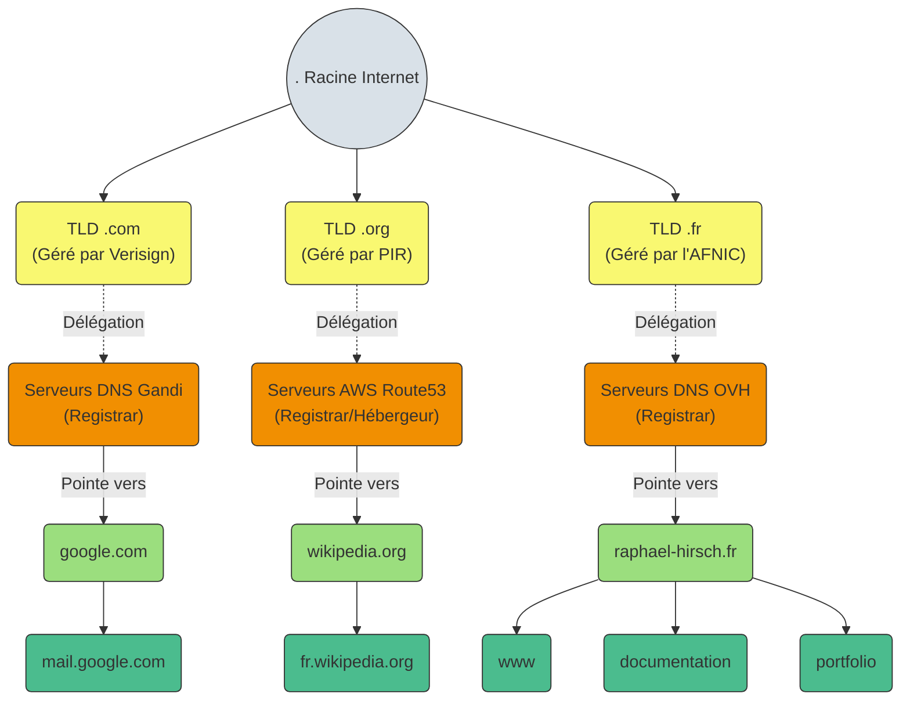
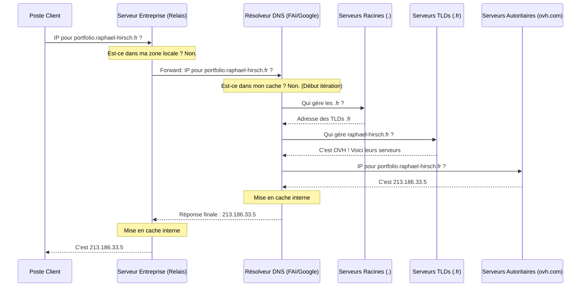

---
tags:
  - Systeme
  - Services
  - DNS
---

# DNS (Domain Name System)

Le DNS est le service informatique permettant de traduire un nom de domaine en adresse IP.

## Fonctionnement et Arborescence

L'espace de noms DNS est structuré sous forme d'une arborescence hiérarchique stricte, avec une délégation des responsabilités à chaque niveau, comme illustré dans ce schéma :

1. **Racine (`.`)** : C'est le sommet de l'arborescence, l'annuaire universel originel.
2. **Domaine de 1er niveau (TLD)** : L'extension. Elle est gérée par un registre racine responsable de son domaine (ex: l'**AFNIC** pour le `.fr`, **Verisign** pour le `.com`, **PIR** pour le `.org`).
3. **Le Registrar (Bureau d'enregistrement)** : Les registres (AFNIC, Verisign, etc.) ne vendent pas de noms directement au public. Ils délèguent techniquement cette tâche à des distributeurs agréés: les **registrars** (ex: OVH, Gandi, AWS Route53, Hostinger). Le registre de 1er niveau note simplement dans ses tables : "Pour trouver le domaine *raphael-hirsch.fr*, interrogez les serveurs DNS de l'infrastructure OVH".
4. **Domaine de second niveau** : Le nom enregistré et loué par un individu ou une entreprise (ex: `raphael-hirsch.fr`, `wikipedia.org`).
5. **Machines / Sous-domaines (Hôtes)** : Les pointeurs finaux, configurés dans la zone DNS de votre registrar pour mener vers vos divers webapps, serveurs ou messageries (ex: `documentation` , `www`).

Lorsqu'un client (ex: votre navigateur internet) souhaite interagir avec une adresse, il initie un processus de résolution en parcourant cet arbre depuis la racine jusqu'aux serveurs gérant la zone ciblée.

## Résolveurs DNS et Relais DNS

Afin d'optimiser et traiter les requêtes de résolution des clients, on distingue particulièrement :

### Le Résolveur DNS (*DNS Resolver*)
C'est le serveur (souvent fourni par votre FAI ou des acteurs externes comme Google `8.8.8.8` / Cloudflare `1.1.1.1`) qui va se charger de trouver l'adresse IP pour le compte du poste client. 
* Si la réponse n'est pas dans son cache local, il ira interroger itérativement les différents serveurs de l'arborescence internet (Serveurs Racines > Serveurs TLDs > Serveurs Autoritaires du domaine) jusqu'à obtenir l'IP finale.

### Le Relais DNS (*DNS Forwarder*)
Un relais DNS (comme son nom l'indique) se contente de transférer les requêtes non résolvables localement vers un autre serveur (généralement le résolveur de l'entreprise ou du FAI).
* **Use case classique** : Le serveur DNS local d'une entreprise ou une box internet va d'abord résoudre les adresses du réseau local (ex: imprimantes, serveurs internes). Si un client demande une adresse sur Internet qu'il ne connait pas (ex: `google.com`), le serveur DNS local agit comme un **relais** en transférant la requête à un résolveur externe.

### Schéma de fonctionnement (Relais vs Résolveur)

Voici le parcours type d'une requête DNS, illustrant le rôle du relais et du résolveur :

## Types d'enregistrements DNS

| Type d'enregistrement | Description | Use case |
| :--- | :--- | :--- |
| **A** | Associe un nom d'hôte à une adresse IPv4. | Faire pointer `www.exemple.com` vers l'adresse IP `192.0.2.1`. |
| **AAAA** | Associe un nom d'hôte à une adresse IPv6. | Faire pointer `www.exemple.com` vers l'adresse IP `2001:db8::1`. |
| **CNAME** | (Canonical Name) Crée un alias qui pointe vers un autre nom de domaine. | Faire pointer `blog.exemple.com` vers `www.exemple.com`. Utile si l'IP cible change fréquemment. |
| **MX** | (Mail Exchange) Définit le ou les serveurs de messagerie responsables du domaine. | Router tous les e-mails destinés à `@exemple.com` vers un fournisseur de messagerie (ex: Microsoft 365, Google Workspace). |
| **TXT** | Permet d'insérer du texte libre. Utilisé pour les méthodes de vérification et de sécurité. | Mettre en place SPF, DKIM, DMARC pour sécuriser les courriels, ou valider la propriété du domaine (ex: Google Search Console). |
| **NS** | (Name Server) Indique quels serveurs DNS sont "autoritaires" pour la zone. | Déléguer la gestion du domaine aux serveurs DNS de votre hébergeur ou registrar (ex: AWS Route 53, Cloudflare). |
| **SRV** | (Service) Précise l'emplacement (nom d'hôte et port) d'un service spécifique. | Localiser des contrôleurs de domaine (Active Directory), serveurs SIP ou serveurs Minecraft. |
| **PTR** | (Pointer) Effectue la résolution inverse (IP vers nom de domaine). | Validation antispam par les serveurs de messagerie qui vérifient l'identité de l'expéditeur via son IP. |
