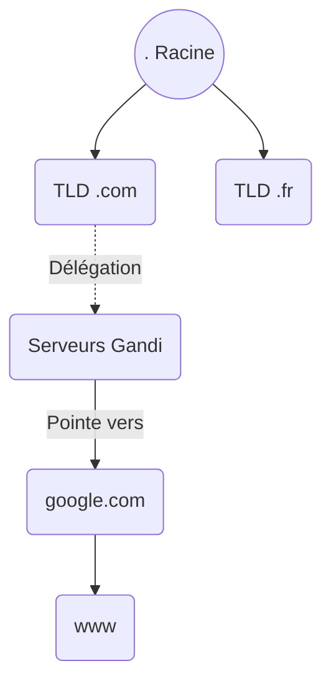
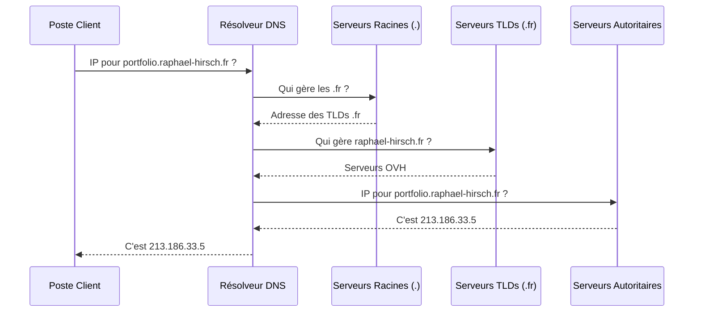

---
tags:
  - Systeme
  - Services
  - DNS
---

# DNS (Domain Name System)

Service informatique fondamental permettant de traduire un nom de domaine lisible en adresse IP.

## 1. Définition
Le DNS (Domain Name System) est l'annuaire de l'Internet. C'est un service informatique mondial et distribué permettant de traduire un nom de domaine facilement mémorisable par un humain (ex: `google.com`) en adresse IP routable par les machines (ex: `142.250.179.46`).

## 2. Description / Fonctionnement
L'espace de noms DNS est structuré sous forme d'une arborescence hiérarchique stricte :
1. **Racine (`.`)** : Le sommet de l'arborescence.
2. **Domaine de 1er niveau (TLD)** : L'extension (ex: `.com`, `.fr`), gérée par un registre (Verisign, AFNIC).
3. **Le Registrar** : Bureau d'enregistrement agréé (ex: OVH, Gandi) louant les domaines au public.
4. **Domaine et Sous-domaines** : `raphael-hirsch.fr` puis `portfolio.raphael-hirsch.fr`.

**Résolveur vs Relais :**
* Le **Résolveur DNS** (ex: Serveur de votre FAI ou Google `8.8.8.8`) cherche l'IP en interrogeant lui-même toute l'arborescence (itération).
* Le **Relais DNS** (ex: votre Box Internet) se contente de transférer simplement la requête de votre PC vers un résolveur externe.

## 3. Utilisation / Cas Pratique
Le DNS est indispensable pour la navigation web, l'envoi d'e-mails, et le fonctionnement des domaines Active Directory. L'administrateur système configure les "Zones DNS" sur son serveur pour y ajouter des enregistrements :
* **A / AAAA** : Associe un nom à une IP (IPv4 / IPv6).
* **CNAME** : Crée un alias pointant vers un autre nom.
* **MX** : Définit les serveurs e-mails du domaine.
* **TXT** : Texte libre (utilisé pour la sécurité anti-spam SPF, DKIM).

## 4. Modifications possibles / Alternatives
L'alternative historique et rudimentaire au DNS était le fichier texte `hosts` local, toujours présent sur chaque machine (sous `C:\Windows\System32\drivers\etc\hosts`), mais inmaintenable à l'échelle d'Internet.

## 5. Exemples visuels et Liens utiles

### Arborescence DNS

```mermaid
graph TD
    Racine((. Racine)) --> com("TLD .com")
    Racine --> fr("TLD .fr")
    com -. Délégation .-> gandi("Serveurs Gandi")
    gandi -- "Pointe vers" --> google("google.com")
    google --> www("www")
```

### Parcours d'une requête via un Résolveur

```mermaid
sequenceDiagram
    participant PC as Poste Client
    participant Resolver as Résolveur DNS
    participant Racine as Serveurs Racines (.)
    participant TLD as Serveurs TLDs (.fr)
    participant Auth as Serveurs Autoritaires

    PC->>Resolver: IP pour portfolio.raphael-hirsch.fr ?
    Resolver->>Racine: Qui gère les .fr ?
    Racine-->>Resolver: Adresse des TLDs .fr
    Resolver->>TLD: Qui gère raphael-hirsch.fr ?
    TLD-->>Resolver: Serveurs OVH
    Resolver->>Auth: IP pour portfolio.raphael-hirsch.fr ?
    Auth-->>Resolver: C'est 213.186.33.5
    Resolver-->>PC: C'est 213.186.33.5
```
