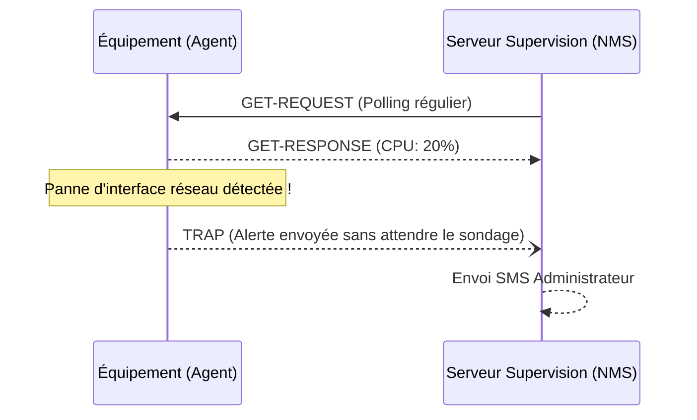

---
tags:
  - Systeme
  - Reseau
  - Supervision
  - SNMP
---

# Supervision (Monitoring)

Surveillance en temps réel de l'état de santé de l'infrastructure IT.

## 1. Définition
La supervision (ou monitoring) consiste à surveiller en permanence et en temps réel l'état de santé, la disponibilité et les performances de l'infrastructure IT (réseaux, serveurs, applications) pour anticiper les pannes et réagir rapidement.

## 2. Description / Fonctionnement
La supervision s'appuie sur **3 piliers de l'observabilité** :
1. **Les Métriques** : Données chiffrées tracées dans le temps (CPU, RAM, bande passante).
2. **Les Logs** : Journaux textuels générés par les événements systèmes.
3. **Les Traces** : Suivi d'une requête utilisateur de bout en bout.

Le protocole standard historique de l'industrie pour les équipements réseau est le **SNMP (Simple Network Management Protocol)**.
Un serveur "Manager" interroge régulièrement des "Agents" installés sur les équipements. Si une anomalie grave survient, l'agent peut aussi envoyer de lui-même une alerte non sollicitée : c'est le **Trap SNMP**.

## 3. Utilisation / Cas Pratique
**Les principaux indicateurs (KPI) de supervision IT :**
Pour assurer la santé de l'infrastructure, l'administrateur configure des seuils d'alerte sur plusieurs métriques critiques :
* **Taux de disponibilité (Uptime)** : Le pourcentage de temps où le service est en ligne (Lié aux contrats de SLA, ex: 99,9%).
* **Consommation CPU / RAM** : Déclenchement d'une alerte "Warning" à 80% d'utilisation, et "Critique" à 95% pour prévenir le plantage total de l'OS.
* **Espace Disque (Stockage)** : Alerte critique si la partition contenant les bases de données passe sous les 5% d'espace libre (cause numéro 1 des crashs de serveurs web).
* **Latence Réseau (Ping)** : Mesurée en millisecondes (ms), c'est le temps de réponse d'un équipement. Une hausse brutale trahit souvent un problème de routage ou de câble.
* **Bande passante (Trafic)** : Le débit en Mbps transitant sur un câble. Déclenchement d'une alerte si une interface réseau sature à 100% de sa capacité.

Lorsqu'un de ces seuils est franchi en temps réel (ex: un lien fibre de secours lâche), le serveur de supervision détecte l'anomalie et envoie instantanément un e-mail, un SMS ou un Webhook Teams à l'administrateur d'astreinte, souvent bien avant que les utilisateurs ne s'en plaignent.

## 4. Modifications possibles / Alternatives
Le SNMP a évolué :
* **v1 et v2c** : Le trafic réseau circule en clair (non sécurisé, à réserver aux réseaux très isolés).
* **v3** : Intègre l'authentification et le chiffrement fort (fortement recommandé).

Au-delà du SNMP, la supervision moderne privilégie l'installation d'agents logiciels dédiés (Push) ou l'utilisation d'APIs pour les environnements Cloud et les conteneurs Kubernetes.

## 5. Exemples visuels et Liens utiles
**Outils courants du marché :**
* *Zabbix*, *Nagios/Centreon*, *PRTG* (Supervision classique SNMP/Agents).
* *Grafana + Prometheus* (Observabilité moderne Cloud Native).
* *Datadog* (Supervision APM SaaS puissante).

### Fonctionnement du Trap SNMP

