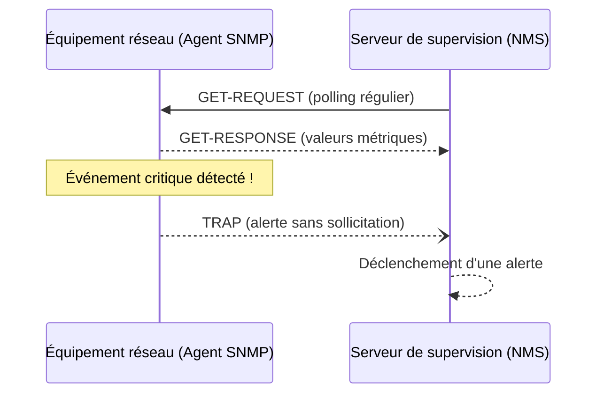

---
tags:
  - Systeme
  - Reseau
  - Supervision
  - SNMP
---

# Supervision des Systèmes et Réseaux

La supervision (ou monitoring) consiste à surveiller en temps réel l'état de santé de l'infrastructure IT pour anticiper les pannes et garantir la disponibilité des services.

## Les 3 piliers de l'observabilité

| Pilier | Description | Exemples |
| :--- | :--- | :--- |
| **Métriques** | Données numériques mesurées dans le temps (CPU, RAM, bande passante) | Grafana, Prometheus, Zabbix |
| **Logs** | Journaux d'événements textuels générés par les systèmes | [SIEM](../Cybersecurite/siem.md), ELK Stack, Graylog |
| **Traces** | Suivi du parcours d'une requête dans une application distribuée | Jaeger, Zipkin, Tempo |

## SNMP — Simple Network Management Protocol

Le **SNMP** est le protocole standard utilisé pour superviser et gérer les équipements réseau (routeurs, switches, serveurs, imprimantes...).

### Composants SNMP

| Composant | Rôle |
| :--- | :--- |
| **Manager (NMS)** | Le serveur de supervision qui interroge les agents |
| **Agent** | Logiciel embarqué sur l'équipement supervisé qui répond aux requêtes |
| **MIB** (Management Information Base) | Base de données hiérarchique des variables supervisables (OID) |
| **OID** (Object Identifier) | Identifiant unique d'une variable SNMP (ex: `1.3.6.1.2.1.1.1.0` = description système) |

### Les versions SNMP

| Version | Sécurité | Usage recommandé |
| :---: | :--- | :--- |
| **v1** | Aucune (communauté en clair) | ❌ Obsolète, abandonner |
| **v2c** | Communauté en clair (mais plus de fonctions) | ⚠️ Acceptable en réseau isolé |
| **v3** | Authentification + chiffrement | ✅ **Recommandé** en production |

### Les Traps SNMP

Un **Trap SNMP** est un mécanisme d'alerte **proactif** : au lieu d'attendre que le Manager interroge l'agent (*polling*), l'agent envoie **lui-même** une notification en cas d'événement critique (panne d'interface, surcharge CPU, redémarrage...).

## Outils de supervision courants

| Outil | Type | Points forts |
| :--- | :--- | :--- |
| **Zabbix** | Open-source | Très complet, SNMP, agents, dashboards |
| **Nagios / Icinga** | Open-source | Pilier historique des checks de disponibilité |
| **PRTG** | Commercial | Très simple d'utilisation, all-in-one |
| **Grafana + Prometheus** | Open-source | Visualisation de métriques, idéal pour infra cloud/kubernetes |
| **Datadog** | SaaS | Cloud-native, APM, observabilité complète |
| **Elastic Stack (ELK)** | Open-source | Logs centralisés, dashboards Kibana |
| **LibreNMS** | Open-source | Découverte automatique réseau, SNMP natif |

## Indicateurs à surveiller

### Système
* **CPU** : Utilisation % (alerte si > 85% pendant +5 min)
* **RAM** : Utilisation % et disponible
* **Disque** : Occupation % et IOPS (alerte si > 90%)
* **Services** : Statut actif/inactif des processus critiques

### Réseau
* **Bande passante** : Débit entrant/sortant par interface
* **Erreurs de paquets** : CRC errors, discards, collisions
* **Latence / Ping** : Temps de réponse entre équipements
* **Disponibilité des liens** : Up/Down des interfaces

### Applicatif
* **Temps de réponse HTTP** : Code retour 200/404/500
* **Disponibilité des URLs** : Probe web externe
* **Certificats SSL** : Date d'expiration
