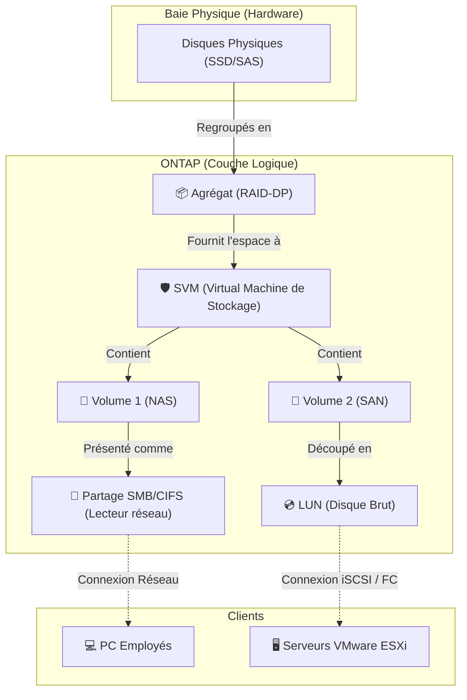

---
tags:
  - Systeme
  - Stockage
  - NetApp
  - SAN
  - NAS
---

# Le Stockage NetApp (ONTAP)

La solution leader de gestion de données centralisée pour les infrastructures d'entreprise.

## 1. Définition
**NetApp** est un constructeur informatique spécialisé dans les solutions de stockage de données à grande échelle (Baies de stockage). Leur système d'exploitation propriétaire, appelé **ONTAP**, permet de gérer le stockage sous forme de **NAS** (Partage de fichiers en réseau type SMB/NFS) et de **SAN** (Présentation de blocs bruts type iSCSI/Fibre Channel) depuis un seul et même équipement unifié.

## 2. Description / Fonctionnement
La force de NetApp repose sur son système de fichiers propriétaire **WAFL** (Write Anywhere File Layout). Il écrit les données de manière séquentielle pour optimiser les performances et permet des fonctionnalités avancées instantanées sans impact sur les performances.

L'architecture logique du stockage dans ONTAP s'empile comme des poupées russes :
1. **Disques Physiques (HDD/SSD)** : Le matériel brut.
2. **Agrégats (Aggregates)** : Un regroupement de disques physiques protégés par RAID (souvent RAID-DP ou RAID-TEC spécifiques à NetApp).
3. **SVM (Storage Virtual Machine)** : Des "baies de stockage virtuelles". Permet de cloisonner le stockage pour différents clients ou départements sur la même machine physique.
4. **Volumes (FlexVol)** : Des conteneurs logiques taillés dans l'agrégat, rattachés à un SVM. C'est ici que sont activées les fonctionnalités comme la déduplication.
5. **LUNs ou Partages (Qtrees)** : Le volume est ensuite soit formaté en partage de fichiers (NAS - CIFS/NFS), soit découpé en disques virtuels (LUN) pour du SAN.

## 3. Utilisation / Cas Pratique
Les baies NetApp sont massivement utilisées dans les centres de données pour deux raisons critiques :
* **L'hébergement des machines virtuelles (SAN)** : Les serveurs VMware (ESXi) ne stockent pas les VMs sur leurs disques locaux, mais se connectent à la baie NetApp en réseau (iSCSI/Fibre Channel) pour y lire et écrire les disques des VMs à une vitesse fulgurante. Si un serveur VMware brûle, un autre serveur peut instantanément relancer la VM depuis la baie NetApp.
* **Les Partages de Fichiers d'Entreprise (NAS)** : NetApp héberge le lecteur "Z:" commun de toute l'entreprise (via protocole CIFS/SMB couplé à [l'Active Directory](OS/ad_forets_domaines.md)). 

## 4. Modifications possibles / Alternatives
**Fonctionnalités avancées NetApp :**
* **Snapshots** : Photos instantanées (en lecture seule) d'un volume. Très économe en espace grâce au WAFL. Permet de restaurer un fichier supprimé par erreur en quelques secondes.
* **SnapMirror** : Réplication asynchrone ou synchrone des données vers une seconde baie NetApp située dans un autre bâtiment pour le [Plan de Reprise d'Activité (PRA)](../../Cybersecurite/pca_pra.md).
* **Déduplication et Compression** : Le système détruit les blocs de données en double pour économiser l'espace disque.

**Alternatives sur le marché :**
* **Dell EMC** (PowerStore, Unity)
* **Pure Storage** (Solution full Flash / NVMe très performante et concurrente directe)
* **HPE Nimble / Alletra**
* **TrueNAS** (Alternative Open-Source basée sur ZFS)

## 5. Exemples visuels et Liens utiles

### Architecture logique de stockage NetApp

