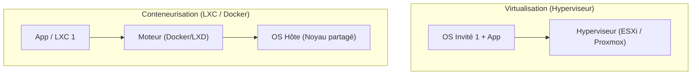

---
tags:
  - Systeme
  - Virtualisation
  - Hyperviseur
  - Conteneurs
  - LXC
---

# Virtualisation et Conteneurisation

Techniques permettant d'isoler des systèmes ou des applications pour maximiser l'utilisation du matériel.

## 1. Définition
* **Virtualisation** : S'appuie sur une couche logicielle (l'hyperviseur) pour simuler un ordinateur physique complet et y exécuter plusieurs systèmes d'exploitation (Machines Virtuelles ou VMs) de manière totalement isolée sur le même matériel physique.
* **Conteneurisation** : Virtualisation légère au niveau de l'OS. Les conteneurs se partagent le même noyau (Kernel) que l'hôte mais restent isolés dans l'espace utilisateur.

## 2. Description / Fonctionnement
* **L'hyperviseur de Type 1 (Bare-Metal)** : S'installe directement sur le matériel, sans OS intermédiaire, pour des performances maximales (ex: VMware ESXi, Proxmox VE). 
* **L'hyperviseur de Type 2** : S'installe sur un OS existant, utile pour les tests sur PC (ex: VirtualBox sur Windows).
* **Les conteneurs systèmes (LXC)** : Simulent un système Linux complet (init, ssh) de façon très légère en partageant le noyau hôte.
* **Les conteneurs applicatifs (Docker)** : Isolent uniquement un processus ou une application spécifique.

## 3. Utilisation / Cas Pratique
* **VMs** : Serveurs de production lourds, isolation forte de sécurité, hébergement d'OS différents (ex: faire tourner un serveur Windows sur une infrastructure physique Linux).
* **LXC** : Déploiement d'environnements de type "serveur Linux" très denses sur Proxmox. Ils sont très rapides à démarrer et consomment très peu de RAM et d'espace disque.
* **Docker** : Architecture microservices, pipelines CI/CD, garantie de portabilité du code entre l'environnement du développeur et la production.

## 4. Modifications possibles / Alternatives

### Les Micro-VMs (Firecracker, Kata Containers)
Une Micro-VM est une machine virtuelle extrêmement allégée, conçue pour démarrer en quelques millisecondes. Elle offre la vitesse de lancement d'un conteneur avec l'isolation de sécurité stricte d'une VM traditionnelle en utilisant un noyau minimaliste. C'est la technologie phare utilisée par le cloud public pour le *Serverless* (ex: AWS Lambda) afin d'exécuter du code de locataires différents sur les mêmes serveurs physiques en toute sécurité.

## 5. Exemples visuels et Liens utiles

### Comparatif VM vs LXC vs Docker
| Caractéristique | Machine Virtuelle (VM) | Conteneur Système (LXC) | Conteneur (Docker) |
| :--- | :--- | :--- | :--- |
| **Périmètre** | OS complet | Environnement OS Linux | Processus (Microservice) |
| **Noyau (Kernel)** | Possède son propre noyau | **Partage le noyau de l'hôte** | **Partage le noyau de l'hôte** |
| **Temps boot** | Lent (Minutes) | Instantané (Secondes) | Instantané (Secondes) |
| **Poids** | Lourd (Plusieurs Go) | Très léger (Quelques Mo) | Très léger (Quelques Mo) |

### Architecture de base

