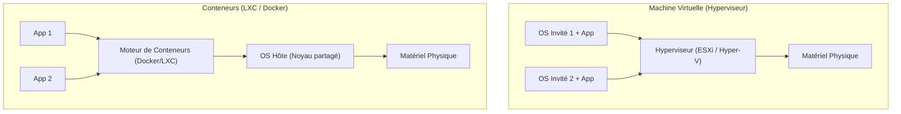

---
tags:
  - Systeme
  - Virtualisation
  - Hyperviseur
  - Conteneurs
  - LXC
---

# Virtualisation et Conteneurisation

La virtualisation et la conteneurisation sont deux approches permettant d'isoler des applications et de maximiser l'utilisation des ressources matérielles. Bien qu'elles répondent à des besoins similaires en termes d'isolation, leur fonctionnement diffère fondamentalement.

## 1. La Virtualisation (Machines Virtuelles - VMs)

La virtualisation s'appuie sur une couche logicielle appelée **hyperviseur**, qui permet d'exécuter plusieurs systèmes d'exploitation (Guest OS) de manière isolée sur une même machine physique (Host).

Chaque VM embarque :
- Un noyau complet (Kernel)
- Les bibliothèques et binaires nécessaires
- L'application

### Hyperviseur de Type 1 (Bare-Metal)
S'installe **directement sur le matériel**, sans OS intermédiaire. Idéal pour les serveurs en production, car les performances sont excellentes.
* **Exemples** : VMware ESXi, Microsoft Hyper-V (Server Core), Proxmox VE (KVM), Xen.

### Hyperviseur de Type 2 (Hosted)
S'installe **au-dessus d'un système d'exploitation hôte** existant (Windows, Linux, macOS). Principalement utilisé pour le test et le développement sur poste de travail.
* **Exemples** : VMware Workstation, Oracle VirtualBox.

## 2. La Conteneurisation

La conteneurisation est une virtualisation **au niveau de l'OS**. Il n'y a pas d'hyperviseur ni de système d'exploitation invité (Guest OS).
Tous les conteneurs se **partagent le même noyau (Kernel)** de l'OS hôte, mais restent isolés les uns des autres dans l'espace utilisateur (user space) grâce aux _Namespaces_ et aux _Cgroups_ sous Linux.

* **Exemples** : [Docker](Conteneurs/docker.md), Podman, Containerd.

### Les Conteneurs Systèmes : LXC / LXD

Les **LXC** (Linux Containers) se situent à mi-chemin entre une VM complète et un conteneur applicatif Docker :
* Contrairement à Docker (qui fait tourner un seul processus par conteneur), un **LXC fait tourner un OS Linux complet** (init, sshd, syslog...) de façon légère, mais toujours en partageant le noyau hôte.
* **LXD / Incus** : Propose une surcouche de gestion aux LXC, les gérant presque comme des VMs (snapshots, migrations, réseau virtuel) au point qu'ils sont très populaires sur des plateformes comme Proxmox.

## 3. Comparatif : VM vs LXC vs Docker

| Caractéristique | Machine Virtuelle (VM) | Conteneur Système (LXC) | Conteneur d'Application (Docker) |
| :--- | :--- | :--- | :--- |
| **Périmètre** | Isole un OS complet | Isole un environnement OS Linux | Isole un processus applicatif (microservice) |
| **Noyau (Kernel)** | Possède son propre noyau | **Partage le noyau de l'hôte** | **Partage le noyau de l'hôte** |
| **Poids (Stockage)** | Lourd (Plusieurs Go) | Très léger (Quelques Mo) | Très léger (Quelques Mo) |
| **Temps de démarrage** | Lent (Minutes) | Quasi instantané (Secondes) | Quasi instantané (Secondes) |
| **Sécurité/Isolation** | Forte (Isolation Hard/Hyperviseur) | Modérée (Namespaces) | Modérée (Namespaces) |

